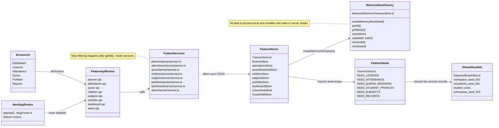
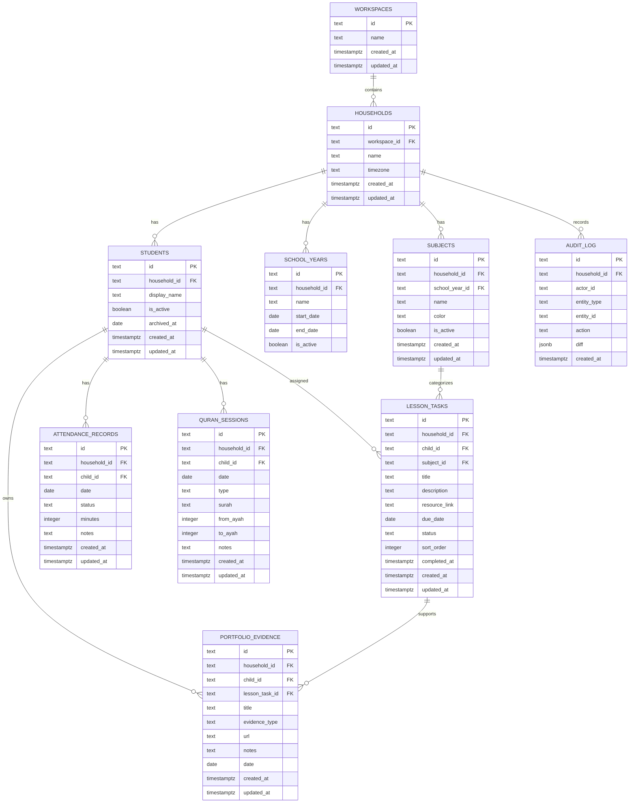

# Development Plan — Move Persistence from Memory Stores to Postgres

Branch: `claude/fix-planner-bugs`

Status: Active

## 1. Summary

Move Sheath Academy from per-feature in-memory stores to durable Postgres persistence using a staged repository migration. The migration must preserve feature ownership, avoid a big-bang rewrite, keep tests stable, and establish sound data principles: explicit schema, household scoping, referential integrity, predictable date handling, auditable writes, safe migrations, and no dashboard-owned duplicate data.

The safest path is not to mutate `createMemoryStore()` into a hidden database adapter. The current memory-store contract is synchronous and generic, while Postgres access is asynchronous and schema-aware. Instead, introduce a shared repository/persistence layer, migrate services to async feature repositories in priority order, and keep memory stores as a test/demo adapter until all feature services are moved.

## 2. Planning Mode

Mode 5 — Architecture Migration.

Reason: this replaces the storage mechanism, changes shared contracts, introduces database schema/migrations, and affects every feature that currently depends on `createMemoryStore()`.

## 3. Current Code Path Audit

### Shared store abstraction

- Rendering component: none; this is server infrastructure.
- Data provider/service: feature server services import feature stores.
- API route called: all feature APIs that call server services are indirectly affected.
- Server service/repository: feature services call stores directly.
- Store/seed/source: `features/lib/server/memoryStore.ts` defines `MemoryStore<T>` and `createMemoryStore(seed)`.
- Current owner: shared lib owns the in-memory helper; each feature owns its own store instance.
- Correct owner: shared lib should own persistence primitives; each feature should own its repository and domain queries.
- Existing tests: `features/lib/__tests__/memoryStore.test.ts` exists.
- Missing tests: repository contract tests, Postgres adapter tests, migration tests, and feature-service tests that pass against both memory and Postgres where practical.

Current facts:

```ts
export interface MemoryStore<T extends { id: string }> {
  getAll(): T[]
  getById(id: string): T | undefined
  insert(item: T): T
  update(id: string, patch: Partial<T>): T | null
  remove(id: string): boolean
  reset(seed: T[]): void
}
```

`createMemoryStore()` deep-clones seed data into a module-level `items` array and returns synchronous CRUD methods.

### Feature store pattern

Known feature stores using `createMemoryStore()` include:

- `features/quran/server/store.ts`
- `features/subjects/server/store.ts`
- `features/planner/server/store.ts`
- `features/dashboard/server/store.ts`
- `features/household/server/store.ts`
- `features/portfolio/server/store.ts`
- `features/school-year/server/store.ts`
- `features/attendance/server/store.ts`
- `features/children/server/store.ts`

Current owner: each feature owns a local `server/store.ts` wrapper around shared memory storage.

Correct owner: each feature should own a repository that expresses feature-specific queries, while shared lib owns the database connection, transaction helper, migration runner, and generic adapter utilities.

Existing tests: feature tests exist in several folders but must be inspected feature by feature before implementation.

Missing tests: repository contract tests for each migrated feature and regression tests proving API behavior is unchanged after moving from memory to Postgres.

### Planner service

- Server service: `features/planner/server/service.ts`.
- Store/source: `lessonsStore` from `features/planner/server/store.ts`.
- Current behavior: `getLessons(childId?, subjectId?)` calls `lessonsStore.getAll()` and filters in memory. `createLessonTask()` validates child and subject through cross-feature services, generates ID, and inserts. `updateLessonTask()` builds an allowed patch and updates the store.
- Current owner: Planner owns lessons.
- Correct owner: Planner repository should own lesson CRUD and list filters, including child, subject, date range, status, household/school-year scope, and ordering.
- Missing tests: repository/API tests proving filters are applied in SQL, not by dashboard or UI code.

### Attendance service

- Server service: `features/attendance/server/service.ts`.
- Store/source: `attendanceStore`.
- Current behavior: `getRecords(filters)` calls `attendanceStore.getAll()` then filters by `childId`, `date`, `startDate`, and `endDate` in memory. Summary counts statuses from filtered records.
- Current owner: Attendance owns attendance records and summaries.
- Correct owner: Attendance repository should own date-range and child filters at the DB query level.
- Missing tests: API/repository tests for child/date/status filters and inclusive date ranges.

### Quran service

- Server service: `features/quran/server/service.ts`.
- Store/source: `quranSessionsStore`.
- Current behavior: `getQuranSessions(childId?)` calls `getAll()` and filters in memory. Summary filters by date range and computes streak from session dates. `addQuranSession()` generates an ID from current count and `Date.now()`.
- Current owner: Quran owns Quran sessions and streaks.
- Correct owner: Quran repository should own child/date filters; Quran service should own streak business logic.
- Missing tests: repository tests for session filters, unique ID generation, streak stability, and date handling.

### Environment and dependencies

- `.env.example` now documents `DATABASE_URL` and split Postgres fields.
- `package.json` currently does not show a Postgres driver, Prisma, Drizzle, or migration dependency.
- Current owner: environment docs exist, but no DB client exists yet.
- Correct owner: shared lib should own DB connection setup; package scripts should own migration/seeding commands.
- Missing tests: config validation tests and smoke test that fails safely when `DATABASE_URL` is missing in Postgres mode.

### Shared IDs and seed data

- Shared seed IDs live in `features/lib/seedIds.ts`.
- Current source: feature seed files reference shared IDs to connect data across memory stores.
- Correct target: seed IDs may be reused for deterministic demo/test seed data, but production rows should use database IDs with stable foreign keys and unique constraints.
- Missing tests: seed idempotency tests and foreign-key validation tests.

## 4. Current Data Architecture UML



## 5. Target Data Architecture UML

```mermaid
classDiagram
  direction LR

  class NextAppRoutes {
    app/api/[...slug]/route.ts
    feature routers
  }

  class FeatureApiRoutes {
    planner api
    attendance api
    quran api
    children api
    subjects api
    portfolio api
    records/reports api
    alerts api
  }

  class FeatureServices {
    domain rules
    validation
    authorization checks
    summary builders
  }

  class FeatureRepositories {
    plannerRepository
    attendanceRepository
    quranRepository
    childrenRepository
    subjectsRepository
    portfolioRepository
    householdRepository
    schoolYearRepository
  }

  class SharedPersistence {
    features/lib/server/db.ts
    query()
    transaction()
    validateDatabaseConfig()
    repository contracts
  }

  class PostgresDatabase {
    households
    students
    school_years
    subjects
    lesson_tasks
    attendance_records
    quran_sessions
    portfolio_evidence
    audit_log
  }

  class MigrationsAndSeeds {
    migrations/*.sql
    scripts/db-migrate
    scripts/db-seed-demo
  }

  class BrowserUI {
    Dashboard
    Lessons
    Attendance
    Quran
    Portfolio
    Reports
  }

  BrowserUI --> FeatureApiRoutes : fetch/axios
  NextAppRoutes --> FeatureApiRoutes : route dispatch
  FeatureApiRoutes --> FeatureServices : await service methods
  FeatureServices --> FeatureRepositories : await repository queries
  FeatureRepositories --> SharedPersistence : query/transaction
  SharedPersistence --> PostgresDatabase : SQL
  MigrationsAndSeeds --> PostgresDatabase : schema + seed data

  note for FeatureRepositories "Queries are feature-owned and filter by household, child, date, status, and school year."
  note for SharedPersistence "Shared lib owns connection and transactions, not feature business rules."
```



## 6. Source-of-Truth Decision

Postgres becomes the durable source of truth for canonical feature data.

Feature ownership remains unchanged:

- Planner owns lesson tasks, lesson status, scheduling, and progress inputs.
- Attendance owns attendance records and attendance summaries.
- Portfolio owns evidence items and lesson-evidence links.
- Quran owns Quran sessions, Quran summaries, and streak calculations.
- Children owns student profiles and active/archived state.
- Subjects owns subject definitions and subject-child/course relationships.
- Household owns household/workspace identity and household timezone.
- School Year owns school-year boundaries.
- Alerts owns generated alert signals, but most alerts should remain derived from source features unless persisted alert history is explicitly required.
- Dashboard composes feature-owned data and must not own canonical data.

Ownership violations to handle:

- `features/dashboard/server/store.ts` and dashboard seed data should not become a Postgres canonical dashboard table. Dashboard seed/store should be deprecated or limited to UI/demo-only data, then removed from dynamic summaries.
- Records summaries should move toward Records/Reports ownership, composed from feature repositories.
- Feature services should stop using `getAll()` plus in-memory filtering for real production paths.

## 7. Best Data Principles

### 7.1 Durable source of truth

Canonical data must live in Postgres, not process memory. In-memory stores may remain only for tests, isolated demos, or offline fixtures.

### 7.2 Explicit schema and constraints

Use real tables, primary keys, foreign keys, unique constraints, `NOT NULL` constraints, and check constraints for enums such as lesson status and attendance status.

### 7.3 Household scoping everywhere

Every household-scoped table must carry `household_id`, either directly or through a required parent relationship. Queries must scope by household before returning data.

### 7.4 Referential integrity

Lessons must reference existing students and subjects. Attendance and Quran sessions must reference existing students. Subjects must reference household/school-year where applicable.

### 7.5 No hidden dashboard data duplication

Dashboard data must be composed from feature repositories. Do not add dashboard tables for lesson progress, Quran streaks, attendance counts, or records summaries unless they are clearly cache/materialized-view tables with invalidation rules.

### 7.6 Date discipline

- Store timestamps as UTC `timestamptz`.
- Store school-day/local calendar dates as `date`.
- Household timezone determines “today.”
- Date ranges must state inclusivity; default range filters should be inclusive.
- School year start/end dates are inclusive.

### 7.7 Auditability

Add an `audit_log` table or structured write logging for create/update/delete actions. At minimum capture actor, household, entity type, entity ID, action, timestamp, and changed fields.

### 7.8 Idempotent migrations and seeds

Migrations must be deterministic and versioned. Demo seed scripts must be idempotent using stable seed IDs or unique keys.

### 7.9 Safe rollout

Support memory and Postgres adapters temporarily behind an environment flag. Migrate one feature at a time with regression tests.

### 7.10 Security and least privilege

Do not commit real credentials. Use `DATABASE_URL` from environment. Validate database config on startup in Postgres mode. Prefer prepared queries/parameterized SQL.

## 8. Proposed Postgres Schema, First Pass

Use this as a starting point, not final DDL. Exact fields must be verified against current feature types before migration.



Schema notes:

- Keep `text` IDs initially to preserve seed IDs and reduce migration risk.
- Add UUIDs later only if there is a clear benefit.
- Add `household_id` directly to high-traffic tables even when derivable through child/subject. This makes scoping explicit and queryable.
- Add indexes for common filters:
  - `lesson_tasks(household_id, child_id, due_date)`
  - `lesson_tasks(household_id, child_id, status)`
  - `attendance_records(household_id, child_id, date)`
  - `quran_sessions(household_id, child_id, date)`
  - `portfolio_evidence(household_id, child_id, date)`
  - `subjects(household_id, school_year_id)`

## 9. Compatibility Strategy

Do not do a big-bang migration.

Use an adapter/repository bridge:

```ts
export interface EntityRepository<T extends { id: string }, Filters = unknown> {
  list(filters?: Filters): Promise<T[]>
  getById(id: string): Promise<T | undefined>
  create(item: T): Promise<T>
  update(id: string, patch: Partial<T>): Promise<T | null>
  delete(id: string): Promise<boolean>
}
```

Memory adapter:

```ts
createMemoryRepository<T, Filters>({ seed, applyFilters })
```

Postgres adapter:

```ts
createPostgresRepository<T, Filters>({ tableName, columns, mapRow, mapEntity, buildWhere })
```

Feature repositories should wrap the generic adapter when it helps, but should expose feature-specific methods:

```ts
plannerRepository.listLessons({ householdId, childId, subjectId, startDate, endDate, status })
attendanceRepository.listRecords({ householdId, childId, startDate, endDate, status })
quranRepository.listSessions({ householdId, childId, startDate, endDate, type })
```

The migration flag should be explicit:

```txt
DATA_STORE=memory|postgres
```

Rules:

- Local tests default to memory unless a Postgres integration test explicitly opts in.
- Preview/production can use Postgres after migrations and seed script pass.
- Do not silently fall back from Postgres to memory in production. Fail fast.

## 10. Acceptance Criteria

### Shared persistence

- App can run in memory mode with existing behavior preserved.
- App can run in Postgres mode when `DATABASE_URL` is set and migrations have run.
- App fails with a clear startup/config error if `DATA_STORE=postgres` and `DATABASE_URL` is missing.
- Shared DB client uses parameterized queries.
- Migration command creates all first-pass tables and indexes.
- Seed command is idempotent and can be run twice without duplicate rows.

### Planner

- Creating a lesson persists to Postgres and survives server restart.
- Updating lesson status to completed/skipped persists and survives server restart.
- Listing lessons by child returns only that child.
- Listing lessons by subject returns only that subject.
- Dashboard summaries still use Planner-owned data, not dashboard seeds.

### Attendance

- Creating/updating attendance records persists to Postgres.
- Filtering attendance by child/date/date range works from DB-backed queries.
- Attendance summaries match records returned by the repository.

### Quran

- Logging a Quran session persists to Postgres.
- Quran session filters by child/date work from DB-backed queries.
- Quran streak calculation uses DB-backed sessions and matches memory-mode behavior.

### Children and subjects

- Active/archived child state is persisted.
- Subject records persist and can be referenced by lessons.
- Foreign key violations are rejected instead of creating orphan rows.

### Dashboard and reports

- Dashboard does not read from dashboard seed/store for canonical counts.
- Dashboard behavior is unchanged except data survives restart.
- Reports/records summaries are composed from feature-owned repositories.

## 11. Data Model / Contract Changes

### New environment variable

```txt
DATA_STORE=memory|postgres
```

Default should be `memory` until the migration is ready.

### New shared server modules

Expected files:

```txt
features/lib/server/db.ts
features/lib/server/repository.ts
features/lib/server/repository.memory.ts
features/lib/server/repository.postgres.ts
features/lib/server/config.ts
```

### New database files/scripts

Expected files:

```txt
db/migrations/001_initial_schema.sql
scripts/db-migrate.mjs
scripts/db-seed-demo.mjs
scripts/db-reset-dev.mjs
```

### Package dependencies

Add one Postgres client and migration approach.

Recommended minimal path:

- `pg` for parameterized SQL.
- `@types/pg` for TypeScript.
- SQL migration scripts in `db/migrations`.

Alternative path:

- Drizzle or Prisma, but this is a larger architectural decision and should not be introduced casually.

### Async service contracts

Current services are synchronous. DB-backed repositories require async calls. Plan to migrate feature services and API routes to async.

Example current:

```ts
export function getLessons(childId?: string): LessonTask[]
```

Target:

```ts
export async function getLessons(filters: LessonFilters): Promise<LessonTask[]>
```

Compatibility option:

- Add async repository methods while keeping memory implementation async via `Promise.resolve()`.
- Migrate API routes feature by feature.
- Avoid mixing sync and async APIs in the same service long-term.

## 12. API / Store / Service Plan

### Shared layer

1. Add config validation for `DATA_STORE` and `DATABASE_URL`.
2. Add Postgres client singleton for server runtime.
3. Add transaction helper:

```ts
withTransaction(async (tx) => { ... })
```

4. Add repository interfaces and memory adapter.
5. Add Postgres adapter utilities for simple CRUD.
6. Keep `createMemoryStore()` for existing code until each feature migrates.

### Migration layer

1. Add `db/migrations/001_initial_schema.sql`.
2. Add `schema_migrations` table.
3. Add migration runner that applies unapplied migrations in order.
4. Add demo seed script using stable seed IDs and `ON CONFLICT DO UPDATE` or `ON CONFLICT DO NOTHING` as appropriate.
5. Add package scripts:

```json
{
  "db:migrate": "node scripts/db-migrate.mjs",
  "db:seed": "node scripts/db-seed-demo.mjs",
  "db:reset:dev": "node scripts/db-reset-dev.mjs"
}
```

### Feature migration order

Migrate in dependency order:

1. Household, children, school-year, subjects.
2. Planner lessons.
3. Attendance records.
4. Quran sessions.
5. Portfolio evidence.
6. Records/Reports summaries.
7. Alerts derivation.
8. Remove/deprecate dashboard seed/store canonical data.

Reason:

- Lessons, attendance, Quran, and portfolio depend on children/household.
- Lessons depend on subjects.
- Dashboard, alerts, records, and reports should compose from feature repositories after source features are durable.

### Per-feature pattern

For each feature:

1. Read type definitions and current service/store/API route.
2. Add repository contract and memory implementation tests.
3. Add Postgres repository tests or integration tests.
4. Convert service to async.
5. Convert API route to await service methods.
6. Keep response shape unchanged.
7. Run existing tests.
8. Add Playwright only if user-visible behavior should prove persistence or cross-feature behavior.

## 13. UI Plan

This migration should not redesign UI.

Expected UI behavior changes only:

- Data persists after server restart.
- Empty states show real empty data instead of seeded fallback.
- Dashboard counts come from feature repositories.

No component visual changes are required except where tests expose stale seeded dashboard behavior.

Accessibility/mobile: no planned UI changes. Existing UI accessibility should not regress.

## 14. Testing Plan

### Unit tests

Shared persistence:

- Config validation accepts `DATA_STORE=memory` without `DATABASE_URL`.
- Config validation rejects `DATA_STORE=postgres` without `DATABASE_URL`.
- SQL where-clause builders parameterize values and do not concatenate raw user input.
- Date helper stores local school days as `YYYY-MM-DD`/SQL `date` and timestamps as UTC.

Repositories:

- Memory repository preserves current CRUD behavior.
- Postgres repository maps rows/entities correctly.
- Demo seed script is idempotent.

Feature services:

- Planner filters by child, subject, status, date range.
- Attendance filters by child/date/date range/status.
- Quran filters by child/date/type and computes streak.
- Children excludes archived children where expected.

### API tests

- Planner APIs return same shape in memory and Postgres modes.
- Attendance APIs return same shape in memory and Postgres modes.
- Quran APIs return same shape in memory and Postgres modes.
- Child/subject foreign key failures return safe validation errors.
- Missing/invalid household scope does not leak other household data.

### Integration tests

- Create/update lesson through API, refetch, and verify persistence.
- Create/update attendance through API, refetch summary, and verify persistence.
- Log Quran session through API, refetch summary/streak, and verify persistence.
- Dashboard summary reads persisted feature data after mutations.

### Playwright tests

Run existing critical flows in Postgres mode:

1. Add/edit lesson, refresh page, verify lesson persists.
2. Mark lesson completed, refresh, verify dashboard/records reflect it.
3. Mark attendance, refresh, verify attendance page and dashboard reflect it.
4. Log Quran session, refresh, verify Quran page and dashboard streak/session counts reflect it.
5. Archive child, refresh, verify archived child is excluded from All Children summaries.

## 15. Build Phases

### Phase 1 — Persistence foundation, no feature migration

Expected files:

- `package.json`
- `.env.example`
- `features/lib/server/config.ts`
- `features/lib/server/db.ts`
- `features/lib/server/repository.ts`
- `features/lib/server/repository.memory.ts`
- `features/lib/server/repository.postgres.ts`
- `features/lib/__tests__/...`

Implementation:

- Add `DATA_STORE` docs.
- Add Postgres dependency.
- Add config validation.
- Add DB client and transaction helper.
- Add async repository contract.
- Add memory adapter preserving current behavior.
- Do not change feature services yet.

Commit: `feat(persistence): add postgres repository foundation`

### Phase 2 — Schema and migration scripts

Expected files:

- `db/migrations/001_initial_schema.sql`
- `scripts/db-migrate.mjs`
- `scripts/db-seed-demo.mjs`
- `scripts/db-reset-dev.mjs`
- `package.json`

Implementation:

- Add schema tables, indexes, constraints.
- Add migration runner.
- Add idempotent demo seed.
- Add migration/seed scripts.

Commit: `feat(db): add initial postgres schema and migrations`

### Phase 3 — Core identity/reference data repositories

Expected files:

- household, children, school-year, subjects server repositories/services/routes/tests.

Implementation:

- Migrate household/children/school-year/subjects to async repositories.
- Preserve API response shapes.
- Add foreign-key and archived-child tests.

Commit: `feat(data): persist household children and subjects`

### Phase 4 — Planner repository migration

Expected files:

- `features/planner/server/repository.ts`
- `features/planner/server/service.ts`
- planner API routes
- planner tests

Implementation:

- Move lesson list/get/create/update/delete to repository.
- Query by household, child, subject, status, due date.
- Preserve status update behavior and dashboard inputs.

Commit: `feat(planner): persist lessons in postgres`

### Phase 5 — Attendance repository migration

Expected files:

- attendance repository/service/API/tests.

Implementation:

- Move attendance records to repository.
- Query child/date/date range/status in SQL.
- Preserve attendance summaries.

Commit: `feat(attendance): persist records in postgres`

### Phase 6 — Quran repository migration

Expected files:

- Quran repository/service/API/tests.

Implementation:

- Move Quran sessions to repository.
- Query child/date/type in SQL.
- Preserve streak logic and dashboard inputs.

Commit: `feat(quran): persist sessions in postgres`

### Phase 7 — Portfolio and records/report composition

Expected files:

- portfolio repository/service/API/tests.
- records/reports summary services/tests.

Implementation:

- Move portfolio evidence to repository.
- Ensure records/reports compose from persisted feature data.
- Remove dashboard seed fallback from canonical records summaries.

Commit: `feat(records): compose reports from persisted feature data`

### Phase 8 — Alerts and dashboard cleanup

Expected files:

- alerts service/tests.
- dashboard server/store cleanup if still used for canonical data.
- dashboard tests.

Implementation:

- Ensure alerts derive from Postgres-backed feature repositories.
- Deprecate/remove dashboard seed/store canonical paths.
- Keep dashboard as composition only.

Commit: `refactor(dashboard): remove memory-backed canonical summaries`

### Phase 9 — Postgres-mode regression and rollout

Expected files:

- e2e tests/config.
- deployment docs.
- README or ops docs.

Implementation:

- Run unit/API/integration tests in memory and Postgres modes where feasible.
- Run Playwright in Postgres mode.
- Document Render migration/seed process.
- Set production `DATA_STORE=postgres` only after green migration.

Commit: `test(db): cover postgres persistence regressions`

## 16. Out of Scope

- No UI redesign.
- No new dashboard seed/store fallback data.
- No auth provider redesign.
- No multi-tenant billing or role permissions beyond household scoping hooks.
- No file/blob storage migration for future uploads.
- No analytics warehouse.
- No materialized dashboard cache unless performance requires it later.
- No UUID conversion unless separately planned.
- No big-bang migration of every feature in one commit.
- No committing real database credentials.

## 17. Manual QA Plan

### Setup

1. Set `DATA_STORE=postgres` and `DATABASE_URL` in `.env.local`.
2. Run `npm run db:migrate`.
3. Run `npm run db:seed`.
4. Start the app.

### Planner persistence

1. Open `/lessons`.
2. Create a lesson for one child and subject.
3. Refresh the page.
4. Confirm the lesson still appears.
5. Mark it completed.
6. Restart the dev server.
7. Confirm status is still completed.

### Attendance persistence

1. Open `/attendance`.
2. Select a child.
3. Mark attendance for today.
4. Refresh and confirm the record remains.
5. Restart server and confirm it remains.

### Quran persistence

1. Open Dashboard or `/quran`.
2. Log a Quran session for a child.
3. Refresh and confirm the session/streak remains.
4. Restart server and confirm it remains.

### Dashboard composition

1. Complete a lesson.
2. Log a Quran session.
3. Mark attendance.
4. Open Dashboard.
5. Confirm dashboard cards reflect the persisted feature data.
6. Restart server and confirm dashboard remains correct.

### Archived child behavior

1. Archive a child.
2. Refresh.
3. Confirm archived child is excluded from All Children summaries.
4. Confirm historical records still exist where reporting requires them.

## 18. Branch and Commit Plan

Branch:

```txt
refactor/postgres-persistence
```

Recommended commit sequence:

```txt
feat(persistence): add postgres repository foundation
feat(db): add initial postgres schema and migrations
feat(data): persist household children and subjects
feat(planner): persist lessons in postgres
feat(attendance): persist records in postgres
feat(quran): persist sessions in postgres
feat(records): compose reports from persisted feature data
refactor(dashboard): remove memory-backed canonical summaries
test(db): cover postgres persistence regressions
docs(db): document postgres rollout and rollback
```

## 19. Risks and Rollback

### Risk: async migration touches many files

Mitigation: migrate feature by feature. Keep memory mode working while converting services. Do not convert all services in one commit.

Rollback: revert the latest feature migration commit and leave prior features in memory mode.

### Risk: hidden dashboard seed dependencies

Mitigation: tests must prove dashboard counts come from feature APIs/repositories. Do not add dashboard fallback data.

Rollback: keep dashboard composition reading feature services; do not restore dashboard seed as canonical data.

### Risk: seed ID and foreign-key mismatch

Mitigation: use deterministic seed IDs and idempotent seed scripts with foreign-key checks.

Rollback: reset dev DB and rerun migrations/seeds.

### Risk: production starts without database config

Mitigation: fail fast when `DATA_STORE=postgres` and `DATABASE_URL` is missing.

Rollback: set `DATA_STORE=memory` only for emergency preview/dev rollback, not as a quiet production fallback.

### Risk: data loss during migration

Mitigation: current in-memory data is not durable. Before production migration, decide whether any existing production data must be exported. If production is still seeded/demo-only, run fresh seed. If real user data exists, create an export script before switching.

Rollback: backup Postgres before destructive migrations. Use additive migrations first.

### Risk: slow dashboard queries

Mitigation: add indexes on household/child/date/status. Optimize feature repositories before adding caches.

Rollback: temporarily reduce dashboard query scope; do not reintroduce duplicate dashboard seed data.

## 20. Final Regression Checklist

- Memory mode still works.
- Postgres mode starts only with valid DB config.
- Migrations run cleanly on an empty DB.
- Seed script is idempotent.
- Core feature APIs preserve response shapes.
- Lesson create/update/status survives server restart.
- Attendance create/update survives server restart.
- Quran session create/update survives server restart.
- Dashboard summaries come from feature-owned repositories.
- Records/reports summaries come from feature-owned repositories.
- Alerts derive from feature-owned repositories.
- Archived children are excluded from active summaries.
- Historical records remain available for reports.
- No raw database credentials are committed.
- No dashboard seed/store canonical fallback remains.
- `npm test` passes.
- `npm run build` passes.
- `npx playwright test` passes in the selected rollout mode.
