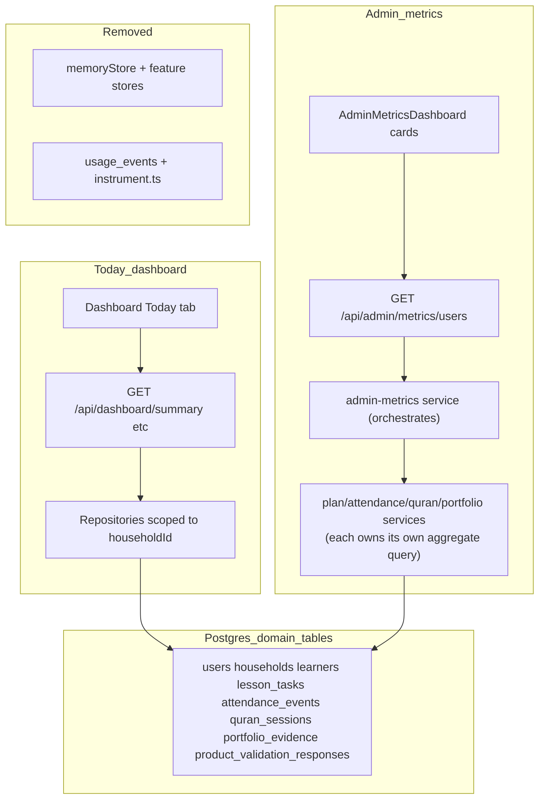

# Postgres-only data platform and demo reset

## Planning mode

**Mode 5 — Architecture migration** ([docs/planning-quality-rule.md](docs/planning-quality-rule.md))

This replaces the prior Phase A–E “cards + light seed” work with a **single source of truth: Postgres domain tables only**.

---

## What you asked for (mapped)

| Requirement | Plan approach |
|-------------|----------------|
| No memory, DB only | Require `DATABASE_URL`; remove `DATA_STORE=memory`, `isPostgresMode()` branches, `createMemoryStore`, feature `server/store.ts` paths |
| No `usage_events` | Drop table via migration; delete instrumentation; admin reads **real rows** |
| DB **empty** then repopulate | New `npm run db:wipe` → truncate all app tables; new `npm run db:seed:demo` → **two** rich households |
| Ignore isolation seeds | Remove `db:seed:isolation`, isolation cleanup, `ISOLATION_PG_SEED`; keep **auth isolation e2e** (creates its own users in test) |
| Today vs Admin | Same tables; **Today** = scoped to session `householdId`; **Admin** = cross-household aggregates (different queries, different UI) |
| Product validation in DB | Postgres repository on `product_validation_responses`; remove [features/product-validation/server/store.ts](features/product-validation/server/store.ts) |
| CLAUDE.md | Remove in-memory / memory-store / `DATA_STORE` guidance; document Postgres-only + constraints location |

**Post-wipe seed (per your clarification):** wipe, then seed **two users** with **months** of data, **3–4 learners each**, heavy attendance / Qur’an / lessons / evidence — not “stay empty.”

Suggested demo accounts (configurable via `.env.local`):

- **Household A:** `DEV_SEED_USER_EMAIL` (default `dev@sheathacademy.ai`) — dev bypass + Today QA
- **Household B:** `DEMO_PARENT_B_EMAIL` (default `demo-parent-b@sheathacademy.ai` — replace with `amina@gmail.com` if that is the real second account you want)

`ADMIN_EMAIL` should match whichever account you use to view `/admin/metrics`.

---

## Where constraints live (not CLAUDE.md)

| Source | Contents |
|--------|----------|
| [db/schema.ts](db/schema.ts) | Drizzle tables, FKs, indexes, uniques (`users.email` unique, `households.user_id` unique → **one household per user**) |
| [db/migrations/*.sql](db/migrations/) | Applied SQL (including drop `usage_events` in new migration) |
| [docs/bug_enhancement/20260522-1120-drizzle-postgres-persistence-migration.md](docs/bug_enhancement/20260522-1120-drizzle-postgres-persistence-migration.md) | Migration architecture (update when done) |

**CLAUDE.md change:** add a short **“Database constraints”** pointer to `db/schema.ts`; delete paragraphs that describe memory as production path.

---

## Current vs target architecture



**Isolation (what it was):** `npm run db:seed:isolation` created `isolation-a@` / `isolation-b@` for **automated tests** so two families could not see each other’s data. It is **not** needed for your demo and clutters Admin. We remove the script; [e2e/auth-isolation.spec.ts](e2e/auth-isolation.spec.ts) should create/delete its own users via API or test helpers instead.

---

## Code path audit (admin + validation)

| Surface | Today | Admin |
|---------|-------|-------|
| Data scope | `getHouseholdContext()` → one household | All `households` ⋈ `users` |
| Lessons | `lesson_tasks` by due date / today | Count rows in period per household (keep [getLessonTaskPeriodCounts](features/plan/server/service.ts)) |
| Attendance | `attendance_events` | `COUNT(*)` in period |
| Qur’an | `quran_sessions` | `COUNT(*)` in period |
| Evidence | `portfolio_evidence` | `COUNT(*)` in period |
| Reports | No `reports` table in schema | **Remove** `reportsGenerated` / drop-off tied to `report_generated` until reports are persisted |
| Last active | N/A | `MAX(updated_at)` / `MAX(occurred_at)` across domain tables in period |
| Product validation | N/A | [AdminValidationSummary](features/product-validation/front/components/AdminValidationSummary.tsx) ← Postgres list/summary |

**Delete entirely:** [features/admin-metrics/server/instrument.ts](features/admin-metrics/server/instrument.ts), [trackUsage.ts](features/admin-metrics/server/trackUsage.ts), [store.ts](features/admin-metrics/server/store.ts), [repository.ts](features/admin-metrics/server/repository.ts) (usage_events), imports from plan/attendance/quran/children/dashboard routes.

**Remove side effect:** [features/dashboard/api/routes/records.ts](features/dashboard/api/routes/records.ts) `trackReportGenerated` on GET (was inflating admin).

---

## Wave 0 — Full wipe + demo seed (operational)

**One-time wipe (not a persistent command)**

The wipe is a one-time manual step using Drizzle — do **not** add `db:wipe` or `db:reset:demo` to `package.json`. A standing wipe command is a liability; once the demo data is in place it should not be trivially destroyed.

Approach: `db/wipe_app_data.sql` contains `TRUNCATE ... CASCADE` in FK-safe order. It lives outside `db/migrations/` to avoid conflicting with drizzle-kit's auto-numbering. Run once directly:

```bash
psql $DATABASE_URL < db/wipe_app_data.sql
```

After it runs, execute `npm run db:seed:demo` to repopulate.

**New script**

- `scripts/seed-demo-households.ts` + `npm run db:seed:demo`  
  - Run manually after the one-time wipe.  
  - **Idempotent** stable IDs in [features/lib/seedIds.ts](features/lib/seedIds.ts) (extend for household B + 3–4 learners each).  
  - **~90 days** back from today:
    - `lesson_tasks`: spread `dueDate`, mixed `status`, use **upsert** (add `upsertLessonTaskRow` or seed by fixed ids — stop `lesson_${Date.now()}` duplicates in [createLessonTaskRow](features/plan/server/repository.ts) for seed path only).  
    - `attendance_events`: multiple days per learner.  
    - `quran_sessions`: weekly pattern per learner.  
    - `portfolio_evidence`: samples linked to subjects.  
  - **No** `usage_events` inserts.

**Remove from [package.json](package.json):** `db:wipe`, `db:reset:demo`, `db:seed:isolation`, isolation branches in [scripts/db-cleanup-test-data.ts](scripts/db-cleanup-test-data.ts) (delete or replace file).

---

## Wave 1 — Database schema migrations

1. **Drop `usage_events`:** new `db/migrations/0003_drop_usage_events.sql` + remove `usageEvents` from [db/schema.ts](db/schema.ts).
2. **Product validation:** migration to add `household_id` (FK → `households`), backfill nullable, deprecate `tenant_id`; align types in [features/product-validation/types.ts](features/product-validation/types.ts).
3. **Admin aggregate indexes:** Existing indexes on domain tables are `(household_id, date_col)` — optimal for dashboard queries where `household_id` is in the WHERE clause. Admin aggregate queries scan across all households (`WHERE date BETWEEN $1 AND $2 GROUP BY household_id`) and need the columns reversed. Add covering indexes in `db/schema.ts` and a new migration:

| Table | New index name | Columns |
|-------|---------------|---------|
| `lesson_tasks` | `lesson_tasks_due_household_idx` | `(due_date, household_id)` |
| `attendance_events` | `attendance_events_date_household_idx` | `(attendance_date, household_id)` |
| `quran_sessions` | `quran_sessions_date_household_idx` | `(session_date, household_id)` |
| `portfolio_evidence` | `portfolio_evidence_date_household_idx` | `(evidence_date, household_id)` |

These let Postgres index-scan the date range and read `household_id` without a heap fetch, then aggregate. The existing `(household_id, date)` indexes remain for dashboard queries — both sets are needed.

Run `db:generate` then `db:migrate` to produce and apply the migration SQL.

Run `db:migrate` after wipe/seed scripts are ready.

---

## Wave 2 — Postgres-only platform (remove memory)

**Core**

- [features/lib/server/db.ts](features/lib/server/db.ts): `getDb()` required at runtime; remove `isPostgresMode()` / `DATA_STORE` (or hard-fail if `DATA_STORE===memory'`).
- Delete [features/lib/server/memoryStore.ts](features/lib/server/memoryStore.ts) and [features/lib/__tests__/memoryStore.test.ts](features/lib/__tests__/memoryStore.test.ts).
- Remove all 12 `features/**/server/store.ts` files and memory branches in services ([plan/service](features/plan/server/service.ts), [children/service](features/children/server/service.ts), [household/service](features/household/server/service.ts), etc.).
- API routes: delete `if (isPostgresMode())` — **always** call repository/service (grep ~20 files under `features/**/api`).

**Auth context**

- [features/auth/server/context.ts](features/auth/server/context.ts): ownership checks always hit Postgres repositories (remove `quranSessionsStore` memory import).

**Env / docs**

- [.env.example](.env.example): remove `DATA_STORE=memory`; state `DATABASE_URL` required.
- [CLAUDE.md](CLAUDE.md): rewrite intro, Obligatory, Troubleshooting, Known gaps — **Postgres only**; link `db/schema.ts` for constraints; remove memory-store architecture section.

**Tests**

- Remove `jest.mock('@/features/lib/server/db', () => ({ isPostgresMode: () => false }))` pattern from API tests.
- Strategy: **repository mocks** at service boundary for unit tests; optional `TEST_DATABASE_URL` for integration tests (document in CLAUDE).

---

## Wave 3 — Admin metrics via feature service delegation

**Why not direct SQL aggregation from admin-metrics**

`householdAggregates.ts` doing Drizzle queries directly against `lesson_tasks`, `attendance_events`, `quran_sessions`, and `portfolio_evidence` would violate feature ownership — each table belongs to a different feature's repository. A schema change in any of those features would silently break admin-metrics. The correct pattern is: each feature service exposes admin-scoped aggregate functions; admin-metrics service orchestrates them.

**Feature service additions (each in its own feature)**

Each feature service gets one new exported function with a signature like:

```ts
// features/plan/server/service.ts
getAdminLessonCounts(periodStart: Date, periodEnd: Date): Promise<{ householdId: string; count: number }[]>

// features/attendance/server/service.ts
getAdminAttendanceCounts(periodStart: Date, periodEnd: Date): Promise<{ householdId: string; count: number }[]>

// features/quran/server/service.ts
getAdminQuranCounts(periodStart: Date, periodEnd: Date): Promise<{ householdId: string; count: number }[]>

// features/portfolio/server/service.ts
getAdminEvidenceCounts(periodStart: Date, periodEnd: Date): Promise<{ householdId: string; count: number }[]>
```

These functions are thin: each calls its own feature's repository, which owns the Drizzle query. No cross-feature table access.

**Admin-metrics service**

**Replace** [features/admin-metrics/server/service.ts](features/admin-metrics/server/service.ts) + [metrics.ts](features/admin-metrics/server/metrics.ts) with a service that:

- Calls `getAdminLessonCounts`, `getAdminAttendanceCounts`, `getAdminQuranCounts`, `getAdminEvidenceCounts` in parallel.
- Fetches all households + learner names via the household/children service (already cross-feature safe).
- Merges results by `householdId` to produce the per-family card shape.
- Derives **drop-off signals** from domain facts (e.g. learners exist but zero attendance/lessons/quran in period) — no event types.

The API route (`GET /api/admin/metrics`) stays unchanged. The service is the only thing that changes.

**Types and UI**

- Slim [features/admin-metrics/types.ts](features/admin-metrics/types.ts): remove `UsageEvent`, `FeatureArea` event model, `reportsGenerated` (or stub 0 with comment until reports table exists).
- Update [AdminMetricsFamilyCard](features/admin-metrics/front/components/AdminMetricsFamilyCard.tsx) labels/glossary in [constants.ts](features/admin-metrics/front/constants.ts) to describe **domain counts**, not usage events.
- TDD: rewrite [metrics.test.ts](features/admin-metrics/__tests__/unit/metrics.test.ts), [adminMetrics.test.ts](features/admin-metrics/__tests__/api/adminMetrics.test.ts) by mocking the four feature service functions — no raw DB calls needed in admin-metrics tests.

---

## Wave 4 — Product validation Postgres

Per [docs/bug_enhancement/20260522-1430-product-validation-admin-metrics-alignment-plan.md](docs/bug_enhancement/20260522-1430-product-validation-admin-metrics-alignment-plan.md) Phase 3:

- Add [features/product-validation/server/repository.ts](features/product-validation/server/repository.ts) (insert/list/getSummary).
- Wire [service.ts](features/product-validation/server/service.ts) to repository; delete memory store.
- API routes unchanged slugs; admin GET uses shared `requireAdminApi`.
- TDD: [service.test.ts](features/product-validation/__tests__/api/service.test.ts) against repository mock or test DB.

After seed + your manual submission, `/admin/metrics` **Product validation** section shows rows **after server restart**.

---

## Wave 5 — Admin card UI polish (enjoyable, label-forward)

Separate from data trust but in same initiative:

- Refine [AdminMetricsFamilyCard](features/admin-metrics/front/components/AdminMetricsFamilyCard.tsx): clearer visual hierarchy (family header band, grouped metric rows, softer borders), keep labels you like.
- Align with [docs/ui-style-guide.md](docs/ui-style-guide.md) record/summary patterns.
- Integration test: still asserts content; optional snapshot-free layout checks.

---

## Wave 6 — Verification and cleanup

| Check | Command / action |
|-------|------------------|
| Wipe + seed | Run `db/migrations/0003_wipe_app_data.sql` once, then `npm run db:seed:demo` |
| Sign in as dev | Today shows months of activity for 3–4 learners |
| Sign in as demo B | Separate household data |
| Admin as `ADMIN_EMAIL` | **Two** family cards with matching SQL counts |
| Product validation | Submit `/feedback` → visible after restart |
| CI | `npm test`, `npm run build` (may need CI `DATABASE_URL` or broader mocks) |
| Delete dead code | `debug-admin-metrics-snapshot.ts`, usage_events docs in backlog |

---

## Risks and mitigations

| Risk | Mitigation |
|------|------------|
| Large blast radius (memory removal) | Land in waves; keep `npm test` green each wave |
| Jest assumed memory mode | Repository mocks + doc test DB for integration |
| No reports table | Remove misleading report metrics until feature persists reports |
| Render without `DATABASE_URL` | Startup fail fast with clear error (already partially there) |
| Second user email | `DEMO_PARENT_B_EMAIL` in `.env.example` — set to `amina@gmail.com` if desired |

---

## Suggested branch and commits

Branch: `refactor/postgres-only-no-usage-events`

1. `feat(db): add wipe script and drop usage_events migration`
2. `feat(db): seed two demo households with 90-day history`
3. `refactor: require postgres; remove memory stores and DATA_STORE`
4. `feat(admin-metrics): aggregate from domain tables`
5. `feat(product-validation): postgres repository`
6. `docs: CLAUDE postgres-only and constraint pointers`
7. `feat(admin-metrics): card visual polish`

---

## Manual QA (after implementation)

1. `npm run db:reset:demo`
2. `npm run dev` with `DATABASE_URL` + `ADMIN_EMAIL=dev@sheathacademy.ai`
3. Dev bypass → **Today**: rich history, correct child filter
4. `/admin/metrics`: two cards, counts align with planner/attendance/quran pages
5. `/feedback` → submit → reload server → response still in **Product validation** section
6. Confirm no references to `usage_events` or `DATA_STORE=memory` in repo grep
