# Merged Direction — Feedback Steward Workflow and Automation

Branch context: `dev`

Status: Merged product direction and phased recommendation. Not yet an approved implementation plan.

## Purpose

Merge three inputs into one coherent direction:

1. The original Feedback Steward automation concept.
2. The product concerns raised in discussion.
3. The current repo reality of the feedback feature, admin review surface, routing, and automation trust level.

This document is intentionally one step more concrete than the original idea note, but still one step earlier than a build-ready implementation plan.

## Merged Recommendation

The merged direction is:

- Make feedback visible to the submitter with a real lifecycle and progress history.
- Give admins a dedicated feedback operations page, not just a small table inside admin metrics.
- Add triage metadata, confidence, and approval controls before the agent is trusted to implement.
- Use a PR-first automation model for code changes, with PRs targeting `dev`.
- Require PR descriptions to include rationale, confidence, linked feedback, and click-by-click UAT steps that point the reviewer to the Render preview environment rather than only to GitHub.
- Restore the changelog idea as a visible community-development loop so shipped feedback can appear in release notes and the About-page changelog.
- Prove automation reliability first with a tiny scheduled file-creation probe before letting the system plan or code against real feedback.

The core merge point is this:

- High confidence should increase what the agent may do.
- High confidence should **not** initially mean bypassing PR review.
- In early versions, confidence decides whether the system can plan, draft, or implement.
- PR review remains the delivery gate for real product changes.

## Current Codebase Baseline

This section anchors the direction in the current codebase rather than desired architecture.

### Current feedback data model

Today the feedback system stores raw submitted rows only:

- `db/schema.ts` defines `user_feedback`
- Fields are currently: `id`, `userId`, `householdId`, `userEmail`, `pagePath`, `sentiment`, `message`, `createdAt`

There is currently no workflow state, triage metadata, PR link, plan path, confidence, approval state, or resolution summary in the table.

### Current feedback write/read flow

- Submit UI: `features/feedback/front/components/FeedbackButton.tsx`
- Submit API client: `features/feedback/front/services/api.ts`
- Submit route: `POST /api/feedback` via `features/feedback/api/router.ts`
- Repository: `features/feedback/server/repository.ts`
- Admin list API: `GET /api/admin/feedback` via `features/feedback/api/adminRouter.ts`
- Admin review UI: `features/feedback/front/components/AdminFeedbackSection.tsx`

### Current admin review surface

Feedback is currently embedded inside the admin metrics page:

- Page: `app/(shell)/admin/metrics/page.tsx`
- Section: `AdminFeedbackSection`

This is useful as an initial review surface, but it is not yet a workflow page.

### Current route ownership constraint

The route `/feedback` is already owned by product validation:

- `app/(auth)/feedback/page.tsx`
- `features/product-validation/front/pages/FeedbackPage.tsx`

That means a user-facing “my feedback status” page should not silently take over `/feedback` unless a route-ownership migration is explicitly planned.

Latest discussion direction:

- the broader feedback workflow should likely own `/feedback`
- product validation should move to a route that clearly reflects that feature rather than permanently owning the generic feedback namespace

### Current tests

Existing coverage already exists for:

- Feedback submit behavior
- Admin feedback table loading, empty state, forbidden state, and error state

This gives a reasonable base for expanding the feature with more metadata and workflow states.

## Product Direction After Merge

## Route ownership

The current route ownership should change so the product model is clearer:

- `/feedback` should become the broader feedback workflow
- `product-validation` should move to a route that explicitly reflects that feature, such as `/product-validation`

Why this is cleaner:

- users naturally expect `/feedback` to show feedback submission and feedback progress
- admins can reason about “feedback” as one feature rather than a route that currently points to a different concern
- product validation remains first-class, but under a route that matches its actual purpose

Recommended route map:

```txt
/feedback                  -> user feedback hub / status page
/feedback/[id]             -> user feedback detail page
/admin/feedback            -> admin feedback operations page
/product-validation        -> product validation feature
```

The existing floating feedback button can still open a lightweight submit flow from anywhere in the app.

## User experience

The user should be able to:

- Submit feedback quickly from the existing lightweight UI.
- Later see their own submitted feedback in a dedicated history/progress page.
- See lifecycle state and whether the item is submitted, classified, awaiting approval, in PR, in QA, shipped, or cancelled.
- See what changed when resolved, including version/commit/PR context where appropriate.

Recommended product shape:

- Keep fast inline submission via the existing feedback button.
- Add a user-facing feedback hub at `/feedback`.
- Add a user-facing feedback detail page at `/feedback/[id]`.
- Move product validation to a route that explicitly names that feature.

## Admin experience

The admin should be able to:

- View all feedback system-wide.
- Filter by status, feature area, confidence, risk, duplicate state, approval state, and PR number.
- Approve items for the next implementation phase.
- See related feedback rows that point to the same PR or changelog entry.
- See PR state, preview environment link, commit/version references, and UAT instructions.
- See whether an open PR should be updated or a new PR should be created.

Recommended product shape:

- Keep a small summary or recent-feedback section on admin metrics if useful.
- Move the canonical workflow surface to a dedicated admin feedback page.
- Recommended direction: `admin metrics` remains metrics-oriented; `admin feedback` becomes the operational queue.

## UI pages and user stories

The easiest way to understand the feature is by the UI surfaces it creates.

### 1. Global feedback submit entry point

Surface:

- existing floating feedback button / lightweight submit panel

User stories:

- As a parent, I can submit quick feedback without leaving the page I am on.
- As a parent, I can describe the problem in plain language without knowing the internal feature name.
- As the system, I capture the page path automatically so context is preserved.

Capabilities:

- quick sentiment + message capture
- automatic page attribution
- authenticated user linkage

### 2. `/feedback` — user feedback hub

User stories:

- As a parent, I can see all feedback I submitted.
- As a parent, I can see whether my item is newly received, being worked on, in QA, or shipped.
- As a parent, I can see if my item was marked duplicate and linked to the canonical feedback record.
- As a parent, I can see which version or PR is associated with my feedback.

Capabilities:

- list of the user’s submitted feedback
- current status
- confidence/risk visibility if desired for transparency
- duplicate indication
- PR number and preview link if relevant
- changelog/release linkage when shipped

### 3. `/feedback/[id]` — user feedback detail

User stories:

- As a parent, I can open one feedback item and understand exactly where it stands.
- As a parent, I can see if my item is part of a PR, what version contains the fix, and where the final release note landed.
- As a parent, I can see a closure note if the item was deferred, blocked, or marked duplicate.

Capabilities:

- full timeline for one feedback item
- PR number
- preview URL when in review
- version resolved
- changelog linkage
- closure note when no PR is involved

### 4. `/admin/feedback` — admin feedback operations

User stories:

- As an admin, I can see system-wide feedback in one operational queue.
- As an admin, I can filter by status, feature area, confidence, risk, duplicate state, and PR number.
- As an admin, I can approve medium-confidence items for implementation.
- As an admin, I can open the Render preview and follow exact UAT steps.
- As an admin, I can see whether a feedback item already maps to an existing PR or release.

Capabilities:

- queue and filtering
- duplicate review
- confidence/risk review
- approval action
- PR + preview visibility
- UAT instructions
- changelog/release visibility

### 5. `/product-validation`

User stories:

- As a user, I can still submit structured product-validation input through a route that clearly reflects that feature.

Capabilities:

- preserves product validation without overloading the `/feedback` namespace

## Confidence policy

The merged confidence model should be explicit and visible in the admin UI.

Recommended model:

| Confidence | Meaning | Default behavior |
|---|---|---|
| High | Clear request, low ambiguity, low blast radius, ownership understood | Agent may classify, dedupe, create or update a PR, and include the item in the daily grouped plan if policy allows |
| Medium | Plausible interpretation but still needs human confirmation | Agent may classify and prepare metadata, but the feedback waits for admin approval before plan execution |
| Low | Ambiguous, conflicting, or architecture-risky | Agent must flag and ask for clarification or human review |

Important merge point:

- “High confidence just do it” should mean “the agent may proceed to the next approved automation step.”
- It should not initially mean “skip PRs” or “push straight to shared branches.”

## Approval policy

An admin approval button is still useful, but the workflow should stay simpler than a large status machine.

Recommended rule:

- Medium confidence requires explicit admin approval before implementation.
- High confidence low-risk items may automatically create or update a PR.
- High-risk categories remain plan-only unless explicitly approved.
- Duplicate handling should be binary, not a separate complex transition graph.

## Status model

The earlier version of this concept drifted into too many workflow states. That is unnecessary for the first version.

The simpler recommendation is:

```txt
submitted
classified
awaiting_approval
in_pr
in_qa
shipped
cancelled
```

Use secondary fields, not extra statuses, for the rest:

- `duplicate_of` -> binary dedupe linkage
- `admin_approved_at` -> explicit approval signal
- `pr_number` -> links related feedback to the same implementation stream

Why simpler is better:

- fewer transitions for users and admins to understand
- easier automation logic
- less token churn for the agent
- fewer inconsistent edge states

## Delivery model

The merged recommendation is PR-first.

Why this best merges the competing instincts:

- It preserves your preference that code changes go through PRs.
- It still allows high-confidence automation to move quickly.
- It fits Render preview environments well.
- It lets `dev` remain the integration branch for milestone releases.

Recommended rule set:

- Implementation PRs should target `dev`, not `main`.
- If there is no open PR for the feedback item or related feedback set, the automation opens one.
- If a PR already exists and is not merged, the automation updates that PR instead of opening a second competing PR.
- If a PR has already been merged, future work for that feedback item or related feedback set opens a new PR.
- The agent should check for an existing PR on `dev` before creating a new one.

## Required PR content

The admin-facing PR and the admin feedback page should expose at least:

- Linked feedback IDs
- Confidence level
- Risk level
- Recommendation / rationale
- What changed
- Why the change is believed to solve the issue
- Tests run
- Render preview URL if available
- UAT steps written for a human reviewer
- PR number

Recommended PR body sections:

```txt
## Feedback
- Feedback IDs

## Recommendation
- Why this change was chosen

## Confidence
- High / Medium / Low

## Risk
- Low / Medium / High

## Summary
- What changed

## How To Test
1. Open the Render preview environment for this PR.
2. Sign in as...
3. Open...
4. Click...
5. Confirm...

## Evidence
- Tests run
- Preview URL
- Plan path
```

The “How To Test” section should also be visible in the admin feedback page so the admin does not need to inspect the PR to know what to validate.

## Community Changelog and Duplicate Detection

The changelog idea should remain in this concept. It is a strong product signal because it shows visible community development rather than hidden internal work.

Recommended direction:

- shipped feedback can generate a changelog entry
- the changelog entry can be surfaced on the existing About-page changelog
- the changelog can optionally credit the submitter when appropriate

Possible entry shape:

```txt
Fixed dashboard learner filtering from linked alert cards.
Suggested by: abusheath
Shipped in: v3.4.2
```

Initial direction:

- changelog entries may directly credit the submitting user
- anonymous or opt-out attribution can be added later if product needs change

Duplicate detection should use the changelog as one signal, but not the only signal.

Recommended duplicate-check order:

1. Open feedback rows
2. Open PRs and active `dev` work
3. Merged PRs
4. Changelog / About-page release entries

Recommended dedupe strategy:

- first pass: database/query match against prior feedback and open PR linkage
- second pass: planning skill reviews the proposed change against existing PRs, shipped work, and the changelog before final classification

This means duplicate detection is not one fragile classifier. It gets two chances:

1. structured lookup
2. plan-time semantic review

That lets the system say:

- already open
- already being worked on
- already shipped in `dev`
- already released in a visible milestone

## Data Model Recommendation

The current `user_feedback` table is too thin for the desired workflow.

The latest discussion simplified the model:

- no separate work-item object in the first version
- the feedback row itself remains the main thing the user and admin follow
- multiple feedback rows may point to the same PR number if they are resolved together

### Keep `user_feedback` as the primary tracked object

Suggested shape for the feedback object:

```ts
type FeedbackStatus =
  | 'submitted'
  | 'classified'
  | 'awaiting_approval'
  | 'in_pr'
  | 'in_qa'
  | 'shipped'
  | 'cancelled'

type FeedbackType =
  | 'bug'
  | 'enhancement'
  | 'ux'
  | 'copy'
  | 'performance'
  | 'question'

type FeedbackRiskLevel = 'low' | 'medium' | 'high'

type FeedbackConfidence = 'high' | 'medium' | 'low'

interface FeedbackRecord {
  id: string
  userId: string | null
  householdId: string | null
  userEmail: string
  pagePath: string
  sentiment: 'bad' | 'poor' | 'okay' | 'good' | 'great'
  message: string | null
  createdAt: string

  status: FeedbackStatus
  featureArea: string | null
  feedbackType: FeedbackType | null
  riskLevel: FeedbackRiskLevel | null
  confidence: FeedbackConfidence | null

  duplicateOfFeedbackId: string | null

  adminApprovedAt: string | null
  adminApprovedByUserId: string | null

  prNumber: number | null
  previewUrl: string | null
  uatInstructions: string | null

  versionResolved: string | null
  resolvedAt: string | null

  changelogVersion: string | null
  changelogLabel: string | null
  changelogUserCredit: string | null
}
```

Equivalent schema direction:

```txt
id text pk
user_id text nullable
household_id text nullable
user_email text not null
page_path text not null
sentiment text not null
message text nullable
created_at timestamp not null

status text not null
feature_area text nullable
feedback_type text nullable
risk_level text nullable
confidence text nullable

duplicate_of_feedback_id text nullable

admin_approved_at timestamp nullable
admin_approved_by_user_id text nullable

pr_number integer nullable
preview_url text nullable
uat_instructions text nullable

version_resolved text nullable
resolved_at timestamp nullable

changelog_version text nullable
changelog_label text nullable
changelog_user_credit text nullable
```

Recommended simplifications from discussion:

- `feedback_type` is clearer than `triage_category` if a separate type field is kept at all
- `needs_human_review` can be derived from confidence, risk, and status in early versions instead of stored as a separate flag
- `resolution_summary` is likely unnecessary for normal PR-based flows
- `pr_number` is preferred over storing a full GitHub PR URL on the row
- `preview_url` matters more than `pr_url` because UAT should point reviewers to the Render preview
- `duplicate_of_feedback_id` carries the dedupe decision without needing a complex duplicate-state workflow
- `cancelled` handles stopped or duplicate items without adding extra closure fields in the first version

### No separate automation-run table in the first version

The current direction is intentionally simpler:

- no `feedback_agent_runs` table
- no separate work-item object
- the feedback row is the tracked object
- PR number, preview URL, and changelog fields provide the visible workflow trace

## Automation Guardrails

## Do-not-automate categories

These should default to plan-only or explicit human-review flows:

- Authentication and authorization
- Security
- Data deletion
- Database migrations
- Billing/payment
- Privacy-sensitive changes
- Architecture-wide refactors
- Permission or ownership changes

## Planning rule integration

Before planning or coding, the steward must read:

- `CLAUDE.md`
- `docs/README.md`
- `docs/planning-quality-rule.md`
- `docs/ui-style-guide.md`
- `docs/architecture-rules.md`
- `docs/testing-patterns.md`
- Any future automation-specific repo rules

Token note:

- this is a lot of context, so the workflow should use skill-specific context loading rather than one giant prompt that reads everything every run
- core repo rules may stay in durable context where possible, but each skill should still read the minimum additional files needed for correctness

Every generated plan should include:

- current source-of-truth owner
- blast radius
- affected files
- required tests
- manual QA / UAT steps
- contradictions or uncertainties

## Workflow diagram

```mermaid
flowchart LR
    A[User submits feedback] --> B[Store feedback row]
    B --> C[Cron job fires each morning]
    C --> D[Claude steward loads core docs and rules]
    D --> E[Read open feedback]
    E --> F[Review only necessary feature files]
    F --> G[Check prior feedback and existing PRs for duplicates]
    G --> H{Cancel as duplicate or not pursue?}

    H -- Yes --> I[Set status to cancelled and update feedback row]
    I --> J[Notify admin and user]

    H -- No --> K[Check PR exists on dev]
    K --> L[Create PR if needed or reuse existing PR]
    L --> M[Save PR number and preview URL]
    M --> N[Determine feature area, feedback type, confidence, and risk]
    N --> O[Write metadata back to feedback row]
    O --> P{High confidence, low risk, not in do-not-automate?}

    P -- No --> Q[Set status to awaiting_approval]
    Q --> R[Notify admin and user that approval is needed]

    P -- Yes --> S[Include eligible feedback in the day's grouped plan]
    S --> T[Create one plan for that day's eligible feedback]
    T --> U[Add UAT section and changelog section to the plan]
    U --> V[Execute the grouped plan]
    V --> W[Update PR with summary and UAT]
    W --> X[Set feedback rows to in_pr or in_qa]
    X --> Y[Admin tests in Render preview]
    Y --> Z{PR merged to dev?}
    Z -- No --> W
    Z -- Yes --> AA[PR hook updates feedback rows to shipped]
    AA --> AB[Update changelog and version linkage]
    AB --> AC[Notify admin and user that implementation shipped]
```



## Claude skills for workflow steps

To reduce token churn and keep the agent consistent, the steward workflow should eventually be split into skills rather than one giant prompt.

Recommended skill set:

### `steward-load-context`

Purpose:

- load the core repo guidance and workflow constraints once per morning run

Reads:

- `CLAUDE.md`
- `docs/README.md`
- `docs/planning-quality-rule.md`
- `docs/ui-style-guide.md`
- `docs/architecture-rules.md`
- `docs/testing-patterns.md`

### `feedback-read-queue`

Purpose:

- read the open feedback rows for the run

Output:

- candidate feedback set for that morning

### `feedback-dedupe`

Purpose:

- inspect prior feedback, existing PRs on `dev`, merged PRs, and changelog entries

Output:

- duplicate decision or proceed decision

### `feedback-classify`

Purpose:

- determine feature area, feedback type, confidence, and risk

Output:

- structured metadata for the feedback row

### `feedback-pr-sync`

Purpose:

- check whether a PR already exists for the related feedback and create one on `dev` if needed

Output:

- `pr_number`
- `preview_url`

### `feedback-daily-plan`

Purpose:

- create one grouped plan for all eligible feedback in that morning's run

Output:

- one plan path for the daily grouped execution
- UAT section
- changelog section

### `feedback-execute`

Purpose:

- execute the grouped plan for eligible feedback

Output:

- implementation changes
- test results
- PR update content

### `feedback-uat`

Purpose:

- generate UAT steps that tell reviewers to use the Render preview

Output:

- `uat_instructions`

### `feedback-changelog`

Purpose:

- generate changelog text tied to the shipped version and optional user credit

Output:

- changelog version
- changelog label
- changelog user credit

### `feedback-notify`

Purpose:

- notify admin and user when feedback is cancelled, awaiting approval, implementation started, or shipped

Output:

- alert/dashboard/email payloads depending on the final notification channel

### `feedback-merge-hook`

Purpose:

- update feedback rows when the PR merges to `dev`

Output:

- `status = shipped`
- `version_resolved`
- `resolved_at`

## State rules

The merged recommendation is:

- `submitted` when the feedback is first stored
- `classified` when metadata has been assigned
- `awaiting_approval` when confidence/risk/do-not-automate rules stop execution
- `in_pr` when the feedback is attached to an open PR
- `in_qa` when the PR is ready for admin testing in the Render preview
- `shipped` when a PR hook confirms merge into `dev`
- `cancelled` when the automation decides not to proceed

Important clarification:

- there is no `done` state in the first version
- merge to `dev` is the event that moves shipped work forward
- a PR hook is the cleanest place to update feedback rows after merge

## Automation Trust: Prove It First

The biggest concern raised in discussion is valid:

Can the automation actually run reliably on a schedule before it is trusted with feedback planning or implementation?

The merged recommendation is to prove that first with a tiny automation probe, but the real steward workflow should run each morning rather than every 20 minutes.

## Automation probe

Before feedback planning automation, run a simple repo-safe exercise:

```txt
manual trigger after 5 minutes
then confirm the steward can run on the intended morning schedule
create one timestamped file in a safe probe folder
record run id, timestamp, and success/failure
```

Recommended scope:

- no product code changes
- no database writes
- no PR creation at first
- just prove scheduling, execution, file write, and traceability

Recommended acceptance criteria:

1. The agent can be manually triggered with a short delay.
2. The agent can run on the intended morning schedule.
3. Each run creates a uniquely timestamped file.
4. Each run records a stable run ID and timestamp.
5. A failed run is visible and does not silently disappear.
6. Three consecutive scheduled runs complete without intervention.

Only after that probe succeeds should the system move into feedback triage automation.

## Assumptions To Confirm

These assumptions should be verified before implementation planning:

- A1. The current lightweight feedback table is intended to continue existing rather than being replaced by product validation.
- A2. The broader feedback workflow should eventually own `/feedback`, and product validation should move to a more explicit feature route.
- A3. A dedicated admin feedback page is preferred over keeping feedback only inside admin metrics.
- A4. Admin metrics may still show a compact summary or entry point into admin feedback.
- A5. A user-facing feedback progress page should show only the submitter’s own items.
- A6. High-confidence, low-risk items may automatically create or update a PR without waiting for admin approval.
- A7. PR review still exists even when implementation begins automatically for high-confidence items.
- A8. Implementation PRs should target `dev`.
- A9. If a feedback PR is still open, the steward should update it rather than open duplicates.
- A10. If a feedback PR was merged and more work is needed later, a new PR should be opened.
- A11. PR descriptions must include click-by-click human UAT steps that direct reviewers to the Render preview URL.
- A12. The admin feedback page should surface that UAT guidance without requiring the admin to inspect GitHub first.
- A13. Render preview environments for PRs are available and should be linked into the workflow.
- A14. The changelog/About-page changelog should be part of the stewardship loop and should help drive duplicate detection.
- A15. Changelog entries may directly credit the submitting user in the first version, with anonymous attribution as a future enhancement if needed.
- A16. The initial automation trust test should be a tiny scheduled file-creation probe before real feedback planning.
- A17. High-risk categories remain plan-only until explicitly widened later.
- A18. The steward should run each morning rather than every 20 minutes for normal workflow.
- A19. Eligible feedback from the same morning run should be merged into one grouped plan for execution rather than creating one plan per feedback row.

## Recommended Phased Rollout

The cleverest merge is not “all at once.” It is a staged rollout where each wave proves the next one deserves to exist.

## Wave 0 — Automation viability probe

Goal:

- Prove the agent can run on a schedule and leave an auditable trail.

Scope:

- Safe file-creation probe only
- Run metadata
- Failure visibility
- Morning schedule confirmation

Why first:

- This directly answers the trust question before feedback workflow complexity is added.

## Wave 1 — Feedback lifecycle metadata and visibility

Goal:

- Turn raw feedback rows into visible tracked feedback records.

Scope:

- Feedback statuses
- Route ownership migration
- Triage metadata
- Resolution fields
- PR number and preview URL
- UAT instructions stored on feedback rows
- User-facing progress page
- Admin-facing review data expansion
- Changelog integration design

Recommended route direction:

- `/feedback` becomes the user feedback hub
- `/feedback/[id]` becomes feedback detail
- `/admin/feedback` becomes admin feedback operations
- `/product-validation` becomes product validation

## Wave 2 — Admin review and approval workflow

Goal:

- Let admins approve items for planning and implementation.

Scope:

- Approval button
- Confidence display
- Risk display
- Queue filters
- Clarification flags
- Duplicate detection against feedback, PRs, and changelog
- Notification rules for approval-needed vs cancelled outcomes

## Wave 3 — Daily grouped plan generation

Goal:

- Let the agent classify feedback, group the eligible items from that morning, and create one daily plan.

Scope:

- Manual or scheduled steward run
- Morning run
- Grouping logic for that day's eligible feedback
- One grouped plan under `docs/bug_enhancement`
- Admin digest / summary
- Feedback status transitions through planning

Recommended automation limit:

- Stop at “plan exists and admin can review it”

## Wave 4 — PR-first implementation automation

Goal:

- Allow low-risk approved items to move into implementation.

Scope:

- Branch creation
- Code changes
- Tests
- PR open/update against `dev`
- PR number and preview URL mirrored back into feedback rows
- Render preview URL surfaced
- UAT instructions generated
- changelog candidate generation
- grouped plan execution for that morning's eligible feedback

Recommended gate:

- High confidence + low risk + approved item/batch only

## Wave 5 — Shipping and completion workflow

Goal:

- Close the loop for both admin and submitter.

Scope:

- merged-to-dev state
- version resolved
- submitter-visible update
- admin-visible completion evidence
- PR-hook-driven shipping update

## Claude CLI runner notes

The latest discovery materially strengthens the feasibility of a cron-driven steward:

- `claude -p` can print to stdout and exit cleanly for automation
- `--output-format json` can support structured parsing
- `--json-schema` can constrain output shape
- `--append-system-prompt` can reduce repeated prompt boilerplate
- `--agents` can support reusable agent definitions for step-specific behavior

This means the steward can plausibly run from a local or server cron without needing a separate SDK layer for the first version, as long as repo safety and output discipline are handled carefully.

## Recommendation Summary

If these ideas are merged well, the system should become:

1. A better feedback product for users.
2. A real workflow tool for admins.
3. A cautious automation system that earns trust gradually.

The strongest merged recommendation is:

- build the human workflow first,
- prove automation reliability second,
- let automation plan next,
- let automation code only after approval and only through PRs.

That gives you the responsiveness you want without pretending the automation trust question is already solved.

## Next Planning Step

If this merged direction is accepted, the next document should be a real implementation plan focused on the first safe slice:

```txt
Wave 0 automation probe
+ Wave 1 feedback lifecycle metadata
+ admin feedback page
+ user feedback progress page
```

That would be the smallest meaningful foundation for the rest of the steward workflow.
