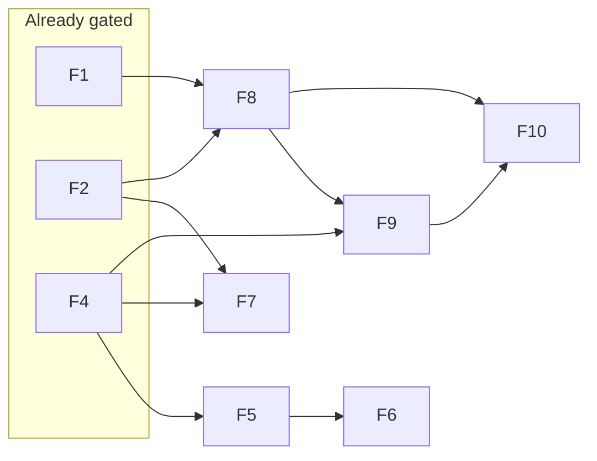

# GitHub re-login command
_Exported on 5/12/2026 at 09:51:19 EDT from Cursor (3.2.21)_

---

**User**

Morning, so I 'm trying to pull but I have to relog in to github. I forget the command to do that. 

---

**Cursor**

Here are the usual ways people “re-login” to GitHub from the terminal on Windows:

### If you use **GitHub CLI** (`gh`)
```bash
gh auth login
```
Follow the prompts (HTTPS vs SSH, browser vs token). To see status:
```bash
gh auth status
```

### If you use **HTTPS** and **Git Credential Manager**
Often a `git pull` is enough: GCM opens a browser or asks for a token. If old credentials are stuck, clear them and pull again:

- **Windows:** Settings → **Credential Manager** → **Windows Credentials** → find `git:https://github.com` (or similar) → **Remove**. Then run `git pull` and sign in when prompted.

From PowerShell you can also try:
```bash
git credential-manager github logout
```
(Exact subcommands can vary slightly by GCM version; `git credential-manager --help` lists options.)

### If you use **SSH**
You don’t “login” with a command the same way; you ensure your key is loaded and GitHub accepts it:
```bash
ssh -T git@github.com
```

**Most common “I need to sign in again” command:** `gh auth login` if `gh` is installed; otherwise fix **Credential Manager** / GCM and run `git pull` again.

If you say whether you clone with HTTPS or SSH (and whether you have `gh`), we can narrow it to one path.

---

**User**

Ok today we are going to work in parrallel I want you to build features 5-10 in parrell. The readme in each folder guides you on how to build them. So we will first need a plan. Thikn about the interdependencies and how we can do these in parelell. Also what version of claude I should use.. do we need opus.. can we use Haiku? Also familiarize yourselve with @sheath-academy/CLAUDE.md  to make sure we are on the same page. 

---

**Cursor**

Reviewing the project guide and locating features 5–10 plus their READMEs to map dependencies and a parallel work plan.


Reading READMEs for features 5–10 to extract build gates and dependencies.


Checking whether prerequisites (features 1–4) appear implemented so the plan reflects the repo state:


Here is a concise plan aligned with `sheath-academy/CLAUDE.md` and the READMEs for features **5–10**.

## Alignment with `CLAUDE.md`

The project guide matches how you should execute this work: logic under `features/` (not fat `app/` routes), shared types and `dataStore` in `features/lib`, REST via the feature routers (`features/dashboard/api/router.ts` pattern and siblings), API envelope `{ status, data, message, timestamp }`, Jest under `features/dashboard/__tests__` / feature `__tests__`, and **`npm run build` + `npm test`** (and `npm run smoke` when you touch UI/flows). Nivo is only a concern if you add charts; these features are mostly shell, selectors, and data model.

CHANGELOG documents **Feature 01**; **household** and **children** code already exists under `features/`, which matches the **build gates** for 5, 7, 8 (they assume **1, 2, 4** are in place). Treat **1, 2, 4** as prerequisites before you call 5–10 “done” in production.

---

## Dependency graph (from the feature READMEs only)

| Feature | Depends on (README) | Build gate |
|--------|----------------------|------------|
| **5** Subject/course data model | Feature **4** | After **4** |
| **6** Create subject/course | Feature **5** | After **5** |
| **7** School year setup | **2**, **4** | After **2** and **4** |
| **8** Parent dashboard shell | **1**, **2** | After **1** and **2** |
| **9** Child selector | **4**, **8** | After **4** and **8** |
| **10** Next setup prompt | **8**, **9** | After **8** and **9** |

So **you cannot build 5–10 all in one parallel wave**: **6** is blocked on **5**, **9** on **8**, **10** on **8** and **9**.



---

## Parallel execution plan (realistic)

**Wave A — up to three streams in parallel** (once **1, 2, 4** are satisfied):

1. **Feature 5** — `subject_course` model + persistence in your in-memory layer + any types/router hooks the README implies.
2. **Feature 7** — `school_year` model + APIs/UI; **no** README dependency on 5 or 8.
3. **Feature 8** — layout / nav / routing / empty-state **scaffold**; README even suggests splitting **8a** (shell) vs **8b** (copy/prompts); **10** overlaps conceptually with “prompts,” so keep **8** thin to avoid duplicate work with **10**.

**Wave B — two streams in parallel** (after Wave A merges or at least after **5** and **8** are stable on `main`):

4. **Feature 6** — needs **5**’s model and APIs.
5. **Feature 9** — needs **8** and **4** only; can run **in parallel with 6** once **8** exists.

**Wave C — single stream:**

6. **Feature 10** — needs **8** and **9**; sequence after **9** (and ideally after **6** is at least drafted so “add subject” prompts are honest—README does not hard-gate 10 on 6, product-wise it helps).

**Merge order to reduce pain:** land **5** before **6**; land **8** before **9** and **10**; **7** can merge whenever tests pass—it is mostly independent **unless** you store school year on the same store modules others are editing—then coordinate touches to `dataStore` / shared types.

**Conflict hotspots for parallel agents:** shared `features/lib` types, mock seed, `dataStore`, and any central dashboard layout files. Split agents by **file ownership** or merge in the order above.

---

## Claude model: Opus vs Haiku

- **Opus (or your strongest model):** Worth it for **Feature 5** (data model + enums/open questions), **Feature 8** (shell vs empty-state split, routing, UX rules), and **merge/integration** passes when several branches touch the same store.
- **Haiku:** Fine for **narrow, well-specified** follow-ups (e.g. extra tests, small UI tweaks, copy tweaks) **after** types and patterns exist. Risky as the **primary** implementer for **5 / 8 / 9 / 10** together—Next.js + TS + router wiring produces subtle integration bugs Haiku will miss more often.
- **Practical split:** **Sonnet-level (or Opus for 5+8)** for implementation waves; **Haiku** for repetitive test or string tasks; **Opus** for one review pass before merge if you used multiple cheaper agents in parallel.

You do **not** need Opus for every line of 6–10 if 5 and 8 are already solid and agents follow `CLAUDE.md` strictly.

---

## Summary

- **Maximum parallel among 5–10:** three tracks (**5, 7, 8**), then two (**6, 9**), then **10**.
- **True “all six at once”** violates your own README gates; use the wave plan instead.
- **Stay on the same page as `CLAUDE.md`:** `features/` modules, API shape, Jest, build/smoke, avoid Nivo foot-guns if charts appear later.

If you want this executed in the repo next, switch to **Agent mode** and we can assign concrete file boundaries per wave so parallel PRs do not stomp each other.

---

**User**

I'm concerned about the Dashboard changing for the parent dashboard but the mockup dashboard already exists. How will this be handleld. Can we build a plan that allows me to run as Opus then run as Haiku. Also you didn't mention TDD is Claude.MD missing that as obligatory. 

---

**Cursor**

Checking how the app routes the dashboard and what `CLAUDE.md` says about tests versus TDD.


Here is a direct read on all three points.

## Existing dashboard vs Feature 8 (“parent dashboard shell”)

You already have a **real parent home**, not a throwaway mock: `(shell)` renders `DashboardProvider` and `features/dashboard/front/pages/Dashboard.tsx`, which loads data, handles loading/error, gates on `useHousehold().needsSetup` with `HouseholdSetup`, and then renders the tabbed “product” UI (`TodayState`, `DoToday`, etc.). So Feature 8 is best treated as **incremental product work on that same surface**, not a second dashboard.

Reasonable handling (pick one clear strategy and stick to it in the plan):

1. **Shell = what you already have** — `AppShell` / `(shell)` layout + header + tabs are the “shell.” Feature 8 work becomes: **empty-state and “what’s next” layers** that sit *around* or *above* the existing grid when data is missing, not a greenfield page.
2. **Compose, don’t fork** — Add something like a `DashboardOnboarding` or `SetupPromptsStrip` that reads the same stores/APIs and only renders when children / subjects / etc. are missing; keep the current cards for the “populated” path (or soften them until later features exist).
3. **Match the spec’s own split** — README for Feature 8 recommends **8a** (layout, nav, routing) vs **8b** (empty states + copy). **8a is largely done** in your tree; the plan should explicitly say “8a = verify/adjust; 8b = new work,” so nobody rebuilds the whole dashboard.
4. **Feature 10** is the guided “next setup” flow; avoid duplicating that inside Feature 8—**8** should stay a thin shell + placeholders; **10** owns ordering/rules for “add child → subject → …”.

So: **one route, one `Dashboard` page, evolving states**—not parallel competing dashboards unless you deliberately introduce a route flag for demos (usually unnecessary).

---

## Plan: Opus first, then Haiku

A workflow that fits your repo gates (`build` + `test` before merge) and reduces risk:

| Phase | Who | Scope |
|--------|-----|--------|
| **1 — Plan** | Opus | Dependency order, data-flow table (per `CLAUDE.md` “End-to-end data flow trace”), which files touch `dataStore` / routers, merge order, **8 vs 10** boundary. |
| **2 — Test plan + skeleton** | Opus | For each new UI: list contexts, interactions, states; add **failing or skipped** integration tests or describe exact `it(...)` blocks in a short checklist Haiku can paste. |
| **3 — Core implementation** | Opus (or Sonnet) | Types, store, API routes, tricky React (selectors, persistence of child filter, school year rules). |
| **4 — Mechanical pass** | Haiku | Boilerplate handlers, extra assertions from the checklist, copy, simple fixtures, repetitive test cases **only where the contract is already fixed**. |
| **5 — Gate** | CI / you | `npm run build` + `npm test` (+ smoke when UI changes). If Haiku’s pass fails, **Opus fixes** the architecture or the test contract—not endless Haiku retries. |

Haiku works when the **spec and file boundaries are frozen**; it is a poor sole owner for “what is the dashboard shell?” because that needs judgment against existing `Dashboard.tsx`.

---

## Is TDD missing from `CLAUDE.md`?

The word **“TDD”** does not appear. What *is* obligatory is spelled out under **“Planning requirements (obligatory for every feature plan)”**:

- For **every new UI component**, the plan must identify contexts, interactions, and **loading / empty / error / populated** states, with tests under `features/*/__tests__/integration/`.
- It explicitly says: **“Write the integration tests in the plan before writing the component.”**

So the doc pushes **test-first planning** and **mandatory integration coverage**, which is aligned with **ATDD / specification-by-example** more than classic **unit-test TDD** (red–green–refactor on tiny functions before they exist). Elsewhere it states **`npm test` must pass before merging**—enforced in CI.

**Bottom line:** TDD is not named, but **“no component without a prior integration test plan”** is obligatory. If you want **strict TDD** (e.g. API handler tests written first, red, then implement), that is an **extra** convention you can add to `CLAUDE.md`; it is not spelled out today.

---

If you want, in Agent mode we can add a single paragraph to `CLAUDE.md` that explicitly ties “planning requirements” to “TDD / ATDD” vocabulary so future you and Haiku runs interpret it the same way.

---

**User**

Why are we not on master. I don't see it in the dropdwon of branches. Switch to master. Then look over @sheath-academy/CLAUDE.md  and see if you need to change anyhting. 

---

**Cursor**

Checking git branches and remotes, then switching to `master` if it exists. Reviewing `CLAUDE.md` afterward.


Identifying the issue: the Cursor workspace is `c:\PROJECTS\sheath-academy` (parent), whose `.git` is on `claude/setup-project-structure-bCsRg` and has no `master`. The real app repo is `c:\PROJECTS\sheath-academy\sheath-academy` — already on `master`. Checking out `master` in the inner repo and updating `CLAUDE.md`: fix `___tests__` → `__tests__`, update test count to 141, add a troubleshooting row for the wrong-folder / no-master case, and add a brief TDD/ATDD note tying planning requirements to terminology.


Generalizing the Git troubleshooting row so it isn't tied to a literal nested folder name:


Here is what was going on and what changed.

## Why you did not see `master`

You have **two different Git roots**:

| Location | Branch | `master`? |
|----------|--------|-----------|
| `c:\PROJECTS\sheath-academy` (parent) | `claude/setup-project-structure-bCsRg` | **No** — only that branch exists on `origin`; `sheath-academy/` is **untracked** here |
| `c:\PROJECTS\sheath-academy\sheath-academy` (inner app) | `master` | **Yes** — tracks `origin/master` |

If Cursor’s workspace is the **parent** folder, the branch picker uses **that** `.git`, so you only see `claude/setup-project-structure-bCsRg`, not `master`.

**What to do:** use **File → Open Folder** and open:

`c:\PROJECTS\sheath-academy\sheath-academy`

(the folder that has root `package.json`, `app/`, `features/`, and `.git` with `master`).

I ran `git checkout master` in that inner repo; it was **already on `master`**.

---

## `CLAUDE.md` updates (in the **inner** repo)

In `sheath-academy/CLAUDE.md` I:

1. **Fixed the test path typo:** `___tests__` → `__tests__` (matches real folders like `features/dashboard/__tests__/`).
2. **Synced the Jest count** with current output: **141** tests (was 82).
3. **Clarified testing vs “TDD”:** after the data-flow table, added a short note that the planning rules are **ATDD-style** (integration/acceptance tests planned before UI), and that strict **unit-test TDD** for every function is encouraged for pure logic but not mandated line-by-line.
4. **Troubleshooting:** new row for **no `master` / wrong history** when the wrong folder is opened as the workspace.

`npm run smoke` in your doc already matches `scripts/smoke.cjs` (health only); no change there.

---

`CLAUDE.md` is modified in the inner repo only. Commit when ready, for example:

`git add CLAUDE.md && git commit -m "docs: fix test paths, update Jest count, clarify ATDD, add Git workspace note"`

