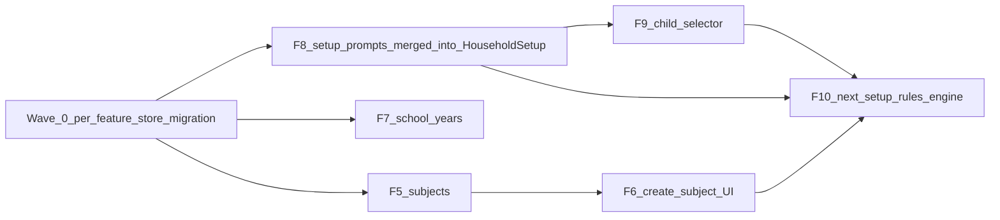

# Features 5–10 Multitask Opus/Haiku Plan

**Abstract.** This document is the single authoritative playbook for implementing Features 5–10 of Sheath Academy. It sequences work across parallel waves, locks the per-feature-store architecture, defines a cross-feature service contract pattern, merges F8 prompts into the existing `HouseholdSetup` screen, and provides copy-paste Haiku briefs so Haiku can do the bulk of the implementation work once Opus has frozen all contracts. Read this in full before writing any code.

---

## 1. Locked Decisions

These decisions are frozen. Do not re-open them in a PR or agent chat.

1. **Per-feature stores.** Every feature owns its own server state. New features (F5 subjects, F7 school years) get their own `server/store.ts` + `server/seed.ts`. Legacy features (`dashboard`, `children`, `household`) are migrated as part of Wave 0.

2. **No feature reaches into another feature's store.** Cross-feature reads go through a **server-side service contract** module (`features/<feature>/server/service.ts`) that exports a stable function surface — equivalent in spirit to calling an API, but without the server-to-server `fetch` baseURL fragility that `CLAUDE.md` warns about. Client (browser) code uses the HTTP API as today.

3. **F8 prompts merge into `HouseholdSetup`.** F8 stops being a separate "empty state strip" and becomes additional setup cards inside the existing first-time setup screen at `features/household/front/components/HouseholdSetup.tsx`. F10 = the post-setup ordered next-action engine that renders on the dashboard after first-time setup is complete.

4. **Canonical learner id = `StudentProfile.id`.** All new entities and the dashboard child selector use this id space. The legacy `Child[]` hardcoded in `DashboardProvider` (line 44–48 of `features/dashboard/front/context/DashboardProvider.tsx`) is removed in Wave 0; tasks seed is realigned.

5. **`app/` stays generic.** Logic stays in `features/`. The only `app/api/[...slug]/route.ts` change is adding new top-level slug branches that delegate to feature routers — the same pattern as the existing `dashboard`, `household`, and `children` branches.

6. **Seed JSON / mock data lives per-feature.** Each `server/seed.ts` is the feature's own canonical seed. The current `features/lib/server/mockData.ts` is split and then deleted along with `features/lib/server/dataStore.ts`.

7. **API envelope.** Every handler returns `{ status, data, message, timestamp }` matching the existing pattern in `features/children/api/routes/children.ts`.

8. **Tests-first (TDD).** For each unit (store helpers, route handlers, services, rule engine) the **failing test commit comes first** in the PR history. Integration tests under `features/<feature>/__tests__/integration/` are mandatory for any new UI component. `npm run build` and `npm test` must pass before merging — CI enforces this.

---

## 2. Architecture: Per-Feature Store + Cross-Feature Service Contract

### 2.1 Folder layout (every feature follows this tree)

```
features/<feature>/
  server/
    store.ts        # private in-memory store — NOT exported outside this feature folder
    seed.ts         # feature-owned seed data; canonical ids live here
    service.ts      # PUBLIC server-side contract; other features import ONLY this file
    ids.ts          # id generator(s) for this feature's entities
  api/
    router.ts       # handleXxxRoute(slug, request) — mirrors children/api/router.ts
    routes/         # handlers; import from ../server/service or ../server/store (own feature only)
  front/
    components/
    context/
    services/api.ts # browser-side HTTP client
  __tests__/
    api/            # unit tests for route handlers
    integration/    # jsdom integration tests for UI components
    fixtures/       # test seed data / factory helpers
```

### 2.2 Enforcement rules (repeat these in every PR description)

- A feature's `server/store.ts` **MUST NOT** be imported from outside its feature folder. Verify with: `grep -r "features/X/server/store" features/ --include="*.ts" --include="*.tsx"` before merging. Follow-up: add an ESLint `no-restricted-imports` rule (out of scope for these PRs).
- Cross-feature server access uses the target feature's `server/service.ts`. Example: `features/subjects/server/service.ts` calls `features/children/server/service.ts:getActiveChildren()` to validate a `childId` — never `features/children/server/store.ts` directly.
- Browser-side cross-feature data still flows over HTTP via the slug router — no change to client patterns.

### 2.3 Generic memory store utility

Introduce one new shared utility file **in Wave 0**:

```
features/lib/server/memoryStore.ts
```

It exports a single generic factory with no domain data:

```ts
export interface MemoryStore<T extends { id: string }> {
  getAll(): T[]
  getById(id: string): T | undefined
  insert(item: T): T
  update(id: string, patch: Partial<T>): T | null
  remove(id: string): boolean
  reset(seed: T[]): void
}

export function createMemoryStore<T extends { id: string }>(seed: T[]): MemoryStore<T> {
  let items: T[] = JSON.parse(JSON.stringify(seed))
  return {
    getAll: () => items,
    getById: (id) => items.find(i => i.id === id),
    insert: (item) => { items.push(item); return item },
    update: (id, patch) => {
      const i = items.findIndex(x => x.id === id)
      if (i === -1) return null
      items[i] = { ...items[i], ...patch }
      return items[i]
    },
    remove: (id) => {
      const before = items.length
      items = items.filter(x => x.id !== id)
      return items.length < before
    },
    reset: (newSeed) => { items = JSON.parse(JSON.stringify(newSeed)) },
  }
}
```

Each feature's `server/store.ts` is a thin instantiation of this factory. No domain logic lives in `memoryStore.ts`.

### 2.4 Seed id constants

A small constants file for cross-seed consistency:

```
features/lib/seedIds.ts   # purely id strings, no domain logic
```

Example:

```ts
export const SEED_IDS = {
  workspace: 'workspace_seed_001',
  household: 'household_seed_001',
  adam: 'student_seed_adam_001',
  khadijah: 'student_seed_khadijah_001',
  zayd: 'student_seed_zayd_001',
} as const
```

Both `features/children/server/seed.ts` and `features/dashboard/server/seed.ts` import from here. Reviewed in Wave 0.

---

## 3. Wave 0 — Architecture Migration PR (Opus, blocking)

> **This PR blocks everything else.** Wave A does not start until Wave 0 is merged.

Wave 0 is a pure refactor: no user-facing behavior changes, all tests stay green.

### 3.1 Files to create

| New file | Content |
|---|---|
| `features/lib/server/memoryStore.ts` | Generic `createMemoryStore<T>` factory (§2.3) |
| `features/lib/seedIds.ts` | Canonical seed id strings (§2.4) |
| `features/household/server/store.ts` | `createMemoryStore` instantiated with workspace + householdProfile slices |
| `features/household/server/seed.ts` | Household seed data extracted from `mockData.ts` |
| `features/household/server/service.ts` | Public exports: `getWorkspace`, `getHouseholdProfile`, `createWorkspace`, `createHouseholdProfile`, `updateHouseholdProfile` |
| `features/household/server/ids.ts` | `generateWorkspaceId()` → `workspace_${Date.now()}`, `generateHouseholdId()` → `household_${Date.now()}` |
| `features/children/server/store.ts` | `createMemoryStore` instantiated with `studentProfiles` slice |
| `features/children/server/seed.ts` | Student seed data extracted from `mockData.ts`; uses `SEED_IDS.adam/khadijah/zayd` |
| `features/children/server/service.ts` | Public exports: `getStudentProfiles`, `getStudentProfile`, `createStudentProfile`, `updateStudentProfile`, `archiveStudentProfile`, `restoreStudentProfile` |
| `features/children/server/ids.ts` | `generateStudentId()` → `student_${Date.now()}_${n}` |
| `features/dashboard/server/store.ts` | `createMemoryStore` for `tasks`, `alerts`, `quranSessions`, `records`, `progressData`, `metrics` |
| `features/dashboard/server/seed.ts` | Dashboard seed; task `childId` values reference `SEED_IDS.adam/khadijah/zayd` |
| `features/dashboard/server/service.ts` | Public exports for all dashboard data helpers |
| `features/dashboard/server/ids.ts` | `generateTaskId()`, `generateQuranSessionId()`, etc. |

### 3.2 Files to modify

| File | Change |
|---|---|
| `features/children/api/routes/children.ts` | Replace `import ... from '@/features/lib/server/dataStore'` with `import ... from '@/features/children/server/service'` |
| `features/children/api/routes/child.ts` | Same import swap |
| `features/household/api/routes/household-profile.ts` | Import from `features/household/server/service` |
| `features/household/api/routes/workspace.ts` | Import from `features/household/server/service` |
| `features/dashboard/api/routes/*.ts` | Import from `features/dashboard/server/service` |
| `features/dashboard/front/context/DashboardProvider.tsx` | Remove hardcoded `childrenData` array; add `useEffect` call to `GET /api/children`; expose `children: StudentProfile[]` in context type |
| `features/dashboard/__tests__/fixtures/mockData.ts` | Update to import from feature seeds or `SEED_IDS` as needed |
| `features/children/__tests__/fixtures/mockStudentProfiles.ts` | Align ids with `SEED_IDS` |
| All test files that import `dataStore` or `mockData` directly | Rewire to feature `service.ts` or fixture files |

### 3.3 Files to delete

- `features/lib/server/dataStore.ts`
- `features/lib/server/mockData.ts`
- `features/dashboard/back/index.ts` (thin re-exporter; remove or replace with a comment)

### 3.4 TDD: failing tests to write first for Wave 0

```
features/household/__tests__/api/workspace.test.ts       (already exists — update imports)
features/household/__tests__/api/household-profile.test.ts (already exists — update imports)
features/children/__tests__/api/children.test.ts         (already exists — update imports)
features/children/__tests__/api/child.test.ts            (already exists — update imports)
features/dashboard/__tests__/api/crud.test.ts            (already exists — update imports)
features/dashboard/__tests__/api/startup.test.ts         (already exists — update imports)
features/dashboard/__tests__/api/integrity.test.ts       (already exists — update imports)
```

New unit tests to add:

```ts
// features/lib/__tests__/memoryStore.test.ts
it('getAll returns all seeded items')
it('getById returns the matching item')
it('getById returns undefined for unknown id')
it('insert appends the item and returns it')
it('update mutates only specified fields')
it('update returns null for unknown id')
it('remove deletes the item and returns true')
it('remove returns false for unknown id')
it('reset restores seed state')
```

### 3.5 Definition of done

- [ ] Failing test commit exists for `memoryStore.test.ts` before any implementation
- [ ] `npm run build` passes
- [ ] `npm test` passes (same count as before + new `memoryStore` tests)
- [ ] `npm run smoke` passes
- [ ] `grep -r "features/lib/server/dataStore" features/ --include="*.ts" --include="*.tsx"` returns nothing
- [ ] `grep -r "features/lib/server/mockData" features/ --include="*.ts" --include="*.tsx"` returns nothing
- [ ] No feature imports another feature's `server/store.ts`
- [ ] PR description includes failing-test commit SHA

---

## 4. Dependency Graph



---

## 5. Waves, Parallelism, and File Ownership

### 5.1 Wave table

| Wave | Parallel tracks | Features | Notes |
|------|-----------------|----------|-------|
| **0** | 1 | Per-feature store migration | **Opus**, strictly serial, single PR; everything blocks on it |
| **A** | 3 | F5 subjects; F7 school years; F8 prompts in HouseholdSetup | Each touches a different feature folder; safe to run concurrently after Wave 0 |
| **B** | 2 | F6 create-subject UI; F9 child selector | F6 in `features/subjects/front/`; F9 in `features/dashboard/front/`; no overlap |
| **C** | 1 | F10 next-setup rules engine | After F6 + F9; consumes services from subjects, school year, children, household |

### 5.2 Parallelism rationale

| Feature | Primary folder(s) touched | Shared files | Conflict risk |
|---------|---------------------------|--------------|---------------|
| F5 subjects | `features/subjects/**` | `app/api/[...slug]/route.ts` (adds `subjects` branch) | Low — different lines from F7 |
| F7 school years | `features/school-year/**` | `app/api/[...slug]/route.ts` (adds `school-years` branch) | Low — different lines from F5 |
| F8 HouseholdSetup prompts | `features/household/front/components/HouseholdSetup.tsx` | None shared with F5/F7 | None |
| F6 subject UI | `features/subjects/front/**` | None | None |
| F9 child selector | `features/dashboard/front/components/ChildSelector.tsx`, `features/dashboard/front/context/DashboardProvider.tsx` | None | None |
| F10 rules engine | `features/setup/**` | None | None |

**Wave A note on `app/api/[...slug]/route.ts`:** F5 owns adding the `subjects` branch; F7 owns adding the `school-years` branch; F8 does not touch this file. They edit different line ranges, so a standard three-way merge resolves cleanly.

### 5.3 Merge order

1. Wave 0 → main
2. Wave A (any order) → main (all three can be reviewed/merged in parallel)
3. Wave B (any order after their dependencies are on main)
4. Wave C after both F6 and F9 are on main

---

## 6. Cross-Feature Dependency Map

| Feature | Reads from | Via |
|---------|------------|-----|
| F5 subjects | children (to validate `childId`) | `features/children/server/service.ts:getStudentProfile(childId)` |
| F6 create-subject UI | subjects HTTP API; children HTTP API (for child picker) | browser `fetch` |
| F7 school year | household (for active workspace id) | `features/household/server/service.ts:getWorkspace()` |
| F8 prompts in HouseholdSetup | own household state; children count (via HTTP); subjects count (via HTTP); school year status (via HTTP) | children/subjects/school-years HTTP APIs (client-rendered per card) |
| F9 child selector | children HTTP API | browser `fetch` via `GET /api/children` |
| F10 rules engine | children, subjects, school year, dashboard tasks | server-side via each feature's `service.ts`; client uses `GET /api/setup-status` |

---

## 7. REST Surface

### 7.1 New branches in `app/api/[...slug]/route.ts`

Add these two blocks immediately after the `children` branch (around line 18):

```ts
if (slug[0] === 'subjects') {
  return await handleSubjectsRoute(slug.slice(1), request)
}

if (slug[0] === 'school-years') {
  return await handleSchoolYearsRoute(slug.slice(1), request)
}
```

Also add in Wave C:

```ts
if (slug[0] === 'setup-status') {
  return await handleSetupStatusRoute(slug.slice(1), request)
}
```

Add the corresponding imports at the top of the file:

```ts
import { handleSubjectsRoute } from '@/features/subjects/api/router'
import { handleSchoolYearsRoute } from '@/features/school-year/api/router'
// Wave C:
import { handleSetupStatusRoute } from '@/features/setup/api/router'
```

### 7.2 F5 Subjects API

| Method | Path | Body | Response |
|--------|------|------|----------|
| GET | `/api/subjects?childId=…` | — | `ApiResponse<SubjectCourse[]>` |
| GET | `/api/subjects/:id` | — | `ApiResponse<SubjectCourse>` |
| POST | `/api/subjects` | `{ childId, name, category, order? }` | `ApiResponse<SubjectCourse>` |
| PUT | `/api/subjects/:id` | partial `SubjectCourse` | `ApiResponse<SubjectCourse>` |
| PATCH | `/api/subjects/:id/archive` | — | `ApiResponse<SubjectCourse>` |
| PATCH | `/api/subjects/:id/restore` | — | `ApiResponse<SubjectCourse>` |

### 7.3 F7 School Years API

| Method | Path | Body | Response |
|--------|------|------|----------|
| GET | `/api/school-years` | — | `ApiResponse<SchoolYear[]>` |
| GET | `/api/school-years/active` | — | `ApiResponse<SchoolYear \| null>` |
| POST | `/api/school-years` | `{ name, startDate, endDate, isActive? }` | `ApiResponse<SchoolYear>` |
| PUT | `/api/school-years/:id` | partial `SchoolYear` | `ApiResponse<SchoolYear>` |
| PATCH | `/api/school-years/:id/activate` | — | `ApiResponse<SchoolYear>` |

### 7.4 F10 Setup Status API (Wave C)

| Method | Path | Body | Response |
|--------|------|------|----------|
| GET | `/api/setup-status` | — | `ApiResponse<{ nextStep: SetupStep \| null, completed: SetupStep[] }>` |

`SetupStep` enum: `'household' | 'firstChild' | 'firstSubject' | 'firstLesson' | 'firstAttendance' | 'firstPortfolio'`

---

## 8. Types to Add

### 8.1 `features/subjects/types.ts`

```ts
export type SubjectCourseCategory =
  | 'Quran' | 'Arabic' | 'IslamicStudies'
  | 'Math' | 'Reading' | 'Science' | 'History' | 'English' | 'Other'

export interface SubjectCourse {
  id: string            // 'subject_<timestamp>_<n>'
  childId: string       // StudentProfile.id
  name: string
  category: SubjectCourseCategory
  isActive: boolean
  order: number
  createdAt: string
}
```

### 8.2 `features/school-year/types.ts`

```ts
export interface SchoolYear {
  id: string            // 'schoolyear_<timestamp>_<n>'
  workspaceId: string
  name: string
  startDate: string     // ISO yyyy-mm-dd
  endDate: string       // ISO yyyy-mm-dd
  isActive: boolean
  createdAt: string
}
```

### 8.3 `features/setup/types.ts` (Wave C)

```ts
export type SetupStep =
  | 'household'
  | 'firstChild'
  | 'firstSubject'
  | 'firstLesson'
  | 'firstAttendance'
  | 'firstPortfolio'

export interface SetupStatus {
  nextStep: SetupStep | null
  completed: SetupStep[]
}
```

---

## 9. Per-Feature Briefs

> **Usage for Haiku:** open this document, find your feature section, read all eight headings in order, and implement end-to-end. Do not import another feature's `server/store.ts`. Do not touch files in the "Do not touch" list. Commit the failing tests before any implementation.

---

### Feature 5 — Subjects (Wave A)

#### 9.1.1 Acceptance

- `GET /api/subjects?childId=X` returns only subjects belonging to child X.
- `POST /api/subjects` with a valid `childId` creates a subject; with an unknown `childId` returns 404.
- Archive/restore round-trip works: archived subject has `isActive: false`; restore flips to `true`.
- No UI shipped in this feature (UI is F6).

#### 9.1.2 Files to create / modify

**Create:**
```
features/subjects/types.ts
features/subjects/server/ids.ts
features/subjects/server/store.ts
features/subjects/server/seed.ts
features/subjects/server/service.ts
features/subjects/api/router.ts
features/subjects/api/routes/subjects.ts
features/subjects/api/routes/subject.ts
features/subjects/__tests__/api/subjects.test.ts
features/subjects/__tests__/api/subject.test.ts
features/subjects/__tests__/fixtures/mockSubjects.ts
```

**Modify:**
```
app/api/[...slug]/route.ts   — add subjects branch + import (see §7.1)
```

#### 9.1.3 TDD step 1 — failing tests to write first

File: `features/subjects/__tests__/api/subjects.test.ts`

```ts
it('GET /subjects returns empty array when store is empty')
it('GET /subjects returns all seeded subjects when no childId filter')
it('GET /subjects?childId=X returns only subjects belonging to X')
it('POST /subjects creates a subject with valid childId')
it('POST /subjects returns 404 when childId does not exist in children service')
it('POST /subjects returns 400 when required fields are missing')
```

File: `features/subjects/__tests__/api/subject.test.ts`

```ts
it('GET /subjects/:id returns the subject')
it('GET /subjects/:id returns 404 for unknown id')
it('PUT /subjects/:id updates name and category')
it('PUT /subjects/:id returns 404 for unknown id')
it('PATCH /subjects/:id/archive sets isActive to false')
it('PATCH /subjects/:id/restore sets isActive to true after archive')
it('PATCH /subjects/:id/archive returns 404 for unknown id')
```

#### 9.1.4 TDD step 2 — implementation files

Implement in this order:
1. `features/subjects/types.ts` — copy verbatim from §8.1
2. `features/subjects/server/ids.ts` — `generateSubjectId()` → `` `subject_${Date.now()}_${++counter}` ``
3. `features/subjects/server/seed.ts` — 2–3 seed subjects using `SEED_IDS.adam` as `childId`
4. `features/subjects/server/store.ts` — `createMemoryStore<SubjectCourse>(SEED_SUBJECTS)`; export `subjectsStore`
5. `features/subjects/server/service.ts` — public exports: `getSubjects(childId?)`, `getSubject(id)`, `createSubject(data)`, `updateSubject(id, patch)`, `archiveSubject(id)`, `restoreSubject(id)`
6. `features/subjects/api/routes/subjects.ts` — GET (list) + POST handlers
7. `features/subjects/api/routes/subject.ts` — GET (single), PUT, PATCH archive, PATCH restore handlers
8. `features/subjects/api/router.ts` — `handleSubjectsRoute(slug, request)` matching the pattern in `features/children/api/router.ts`

#### 9.1.5 Integration test matrix

No UI in F5. All coverage is API/unit level (covered above).

#### 9.1.6 Cross-feature reads

- `features/subjects/server/service.ts` imports `getStudentProfile` from **`features/children/server/service.ts`** to validate `childId` in `createSubject`. If `getStudentProfile(childId)` returns `null`, the POST handler returns 404.
- `features/subjects/server/store.ts` does **not** import from `features/children/`.

#### 9.1.7 Smoke check

After `npm run build && npm run smoke`:
- `GET http://localhost:3010/api/subjects` → 200, envelope `{ status: 'success', data: [...] }`

#### 9.1.8 Definition of done

- [ ] Failing test commit SHA included in PR description (commit must be red before implementation)
- [ ] `npm run build` passes
- [ ] `npm test` passes
- [ ] `npm run smoke` passes (`GET /api/subjects` returns 200)
- [ ] No import of `features/children/server/store` anywhere in this PR
- [ ] No import of `features/lib/server/dataStore` anywhere in this PR
- [ ] PR description lists every file created/modified

**Do not touch:**
- `features/children/**`
- `features/household/**`
- `features/dashboard/**`
- `features/lib/server/dataStore.ts` or `mockData.ts`
- Any `app/` file except `app/api/[...slug]/route.ts`

---

### Feature 6 — Create-Subject UI (Wave B)

#### 9.2.1 Acceptance

- A subject form is rendered inside `HouseholdSetup` as the next setup card after at least one child exists.
- The form has a child picker (populated from `GET /api/children`), a name field, and a category dropdown.
- Successful submit calls `POST /api/subjects` and appends the new subject to the list.
- Validation: name required, category required, child required; form shows inline errors on submit with empty fields.
- Subject list shows active subjects for the selected child; archived subjects are hidden by default.

#### 9.2.2 Files to create / modify

**Create:**
```
features/subjects/front/context/SubjectsContext.tsx
features/subjects/front/components/SubjectForm.tsx
features/subjects/front/components/SubjectList.tsx
features/subjects/front/services/api.ts
features/subjects/__tests__/integration/SubjectForm.test.tsx
features/subjects/__tests__/integration/SubjectList.test.tsx
```

**Modify:**
```
features/household/front/components/HouseholdSetup.tsx   — import SubjectForm; render as next card after children card
```

#### 9.2.3 TDD step 1 — failing tests to write first

File: `features/subjects/__tests__/integration/SubjectForm.test.tsx`

```ts
it('renders category dropdown with all SubjectCourseCategory options')
it('renders child picker populated from GET /api/children')
it('shows validation error when name is empty on submit')
it('shows validation error when category is not selected on submit')
it('shows validation error when no child is selected on submit')
it('calls POST /api/subjects on valid submit')
it('shows success state after successful submit')
it('shows error message when POST /api/subjects returns 4xx')
```

File: `features/subjects/__tests__/integration/SubjectList.test.tsx`

```ts
it('renders loading state while fetching')
it('renders empty state when no subjects exist for the selected child')
it('renders populated list of subjects for the selected child')
it('does not show archived subjects by default')
it('calls PATCH /api/subjects/:id/archive when archive button clicked')
```

#### 9.2.4 TDD step 2 — implementation files

1. `features/subjects/front/services/api.ts` — browser HTTP client for subjects endpoints
2. `features/subjects/front/context/SubjectsContext.tsx` — `SubjectsProvider` + `useSubjects`; loads from `GET /api/subjects?childId=`
3. `features/subjects/front/components/SubjectList.tsx` — list with loading/empty/error/populated states
4. `features/subjects/front/components/SubjectForm.tsx` — form with child picker, name, category
5. Extend `features/household/front/components/HouseholdSetup.tsx` to show `SubjectForm` card when `childCount >= 1`

#### 9.2.5 Integration test matrix

| Component | Context(s) to mock | States | User interactions |
|---|---|---|---|
| `SubjectForm` | Mock `GET /api/children` response; mock `POST /api/subjects` | loading children, children loaded, submit success, submit error | fill name, pick category, pick child, submit |
| `SubjectList` | Mock `GET /api/subjects?childId=X` | loading, empty, error, populated | click archive |
| `HouseholdSetup` (extended) | Mock household context; mock `GET /api/children` response | no children → no subject card; one child → subject card visible | — |

Mock contexts in tests — do not render `AppShell` or `HouseholdProvider`.

#### 9.2.6 Cross-feature reads

- `SubjectForm` browser-side calls `GET /api/children` to populate the child picker.
- No server-side cross-feature calls in this feature (all client-rendered).

#### 9.2.7 Smoke check

After `npm run build && npm run start`:
- Navigate to `/` → `HouseholdSetup` (if fresh seed or household exists + child exists, subject card should be visible).
- Fill and submit the subject form → `POST /api/subjects` round-trips successfully.

#### 9.2.8 Definition of done

- [ ] Failing test commit SHA in PR description
- [ ] `npm run build` passes
- [ ] `npm test` passes
- [ ] `npm run smoke` passes
- [ ] Integration tests cover all four states for each component (loading, empty, error, populated)
- [ ] No import of `features/subjects/server/store` from outside `features/subjects/`
- [ ] `'use client'` present on all client components

**Do not touch:**
- `features/children/**`
- `features/dashboard/**` (except `DashboardProvider` if child selector wiring is needed — but that is F9)
- `features/school-year/**`
- `app/api/[...slug]/route.ts` (already updated in Wave A by F5)

---

### Feature 7 — School Years (Wave A)

#### 9.3.1 Acceptance

- `GET /api/school-years` returns all school years for the workspace.
- `GET /api/school-years/active` returns the single active school year or `null`.
- `POST /api/school-years` creates a new school year; `isActive` defaults to `false` unless explicitly `true`.
- `PUT /api/school-years/:id` updates name/dates.
- `PATCH /api/school-years/:id/activate` sets exactly one school year as active (deactivates all others).
- Validation: `endDate` must be strictly after `startDate`; both required.
- A `SchoolYearForm` renders in `HouseholdSetup` as the card after the household name card.

#### 9.3.2 Files to create / modify

**Create:**
```
features/school-year/types.ts
features/school-year/server/ids.ts
features/school-year/server/store.ts
features/school-year/server/seed.ts
features/school-year/server/service.ts
features/school-year/api/router.ts
features/school-year/api/routes/school-years.ts
features/school-year/api/routes/school-year.ts
features/school-year/front/components/SchoolYearForm.tsx
features/school-year/front/services/api.ts
features/school-year/__tests__/api/school-years.test.ts
features/school-year/__tests__/api/school-year.test.ts
features/school-year/__tests__/integration/SchoolYearForm.test.tsx
features/school-year/__tests__/fixtures/mockSchoolYears.ts
```

**Modify:**
```
app/api/[...slug]/route.ts   — add school-years branch + import (see §7.1)
features/household/front/components/HouseholdSetup.tsx   — import SchoolYearForm; render as first card after household name step
```

#### 9.3.3 TDD step 1 — failing tests to write first

File: `features/school-year/__tests__/api/school-years.test.ts`

```ts
it('GET /school-years returns empty array when store is empty')
it('GET /school-years returns all seeded school years')
it('GET /school-years/active returns the active school year')
it('GET /school-years/active returns null when none is active')
it('POST /school-years creates a school year with isActive defaulting to false')
it('POST /school-years returns 400 when endDate is before startDate')
it('POST /school-years returns 400 when required fields are missing')
```

File: `features/school-year/__tests__/api/school-year.test.ts`

```ts
it('GET /school-years/:id returns the school year')
it('GET /school-years/:id returns 404 for unknown id')
it('PUT /school-years/:id updates name and dates')
it('PUT /school-years/:id returns 400 when endDate is before startDate')
it('PATCH /school-years/:id/activate sets isActive true on target and false on all others')
it('PATCH /school-years/:id/activate returns 404 for unknown id')
```

File: `features/school-year/__tests__/integration/SchoolYearForm.test.tsx`

```ts
it('renders form with name, startDate, endDate fields')
it('shows validation error when endDate is before startDate')
it('calls POST /api/school-years on valid submit')
it('shows success state after submit')
it('shows error message when POST returns 4xx')
```

#### 9.3.4 TDD step 2 — implementation files

1. `features/school-year/types.ts` — copy verbatim from §8.2
2. `features/school-year/server/ids.ts` — `generateSchoolYearId()` → `` `schoolyear_${Date.now()}_${++counter}` ``
3. `features/school-year/server/seed.ts` — 1 seed school year; uses `SEED_IDS.workspace` as `workspaceId`
4. `features/school-year/server/store.ts` — `createMemoryStore<SchoolYear>(SEED_SCHOOL_YEARS)`
5. `features/school-year/server/service.ts` — `getSchoolYears()`, `getActiveSchoolYear()`, `createSchoolYear(data)`, `updateSchoolYear(id, patch)`, `activateSchoolYear(id)`
6. `features/school-year/api/routes/school-years.ts` — GET list + GET active + POST handlers
7. `features/school-year/api/routes/school-year.ts` — GET single, PUT, PATCH activate handlers
8. `features/school-year/api/router.ts` — `handleSchoolYearsRoute(slug, request)`
9. `features/school-year/front/services/api.ts` — browser HTTP client
10. `features/school-year/front/components/SchoolYearForm.tsx` — form component

#### 9.3.5 Integration test matrix

| Component | Context(s) to mock | States | User interactions |
|---|---|---|---|
| `SchoolYearForm` | Mock `POST /api/school-years` | initial, submit success, submit validation error, submit API error | fill name/dates, submit |
| `HouseholdSetup` (extended) | Mock household context | household step → school year card visible | — |

#### 9.3.6 Cross-feature reads

- `features/school-year/server/service.ts` imports `getWorkspace` from **`features/household/server/service.ts`** — used if workspace-scoped queries are needed server-side. The seed's `workspaceId` comes from `SEED_IDS.workspace`.
- No household store import.

#### 9.3.7 Smoke check

After `npm run build && npm run smoke`:
- `GET http://localhost:3010/api/school-years` → 200
- `GET http://localhost:3010/api/school-years/active` → 200

#### 9.3.8 Definition of done

- [ ] Failing test commit SHA in PR description
- [ ] `npm run build` passes
- [ ] `npm test` passes
- [ ] `npm run smoke` passes
- [ ] `PATCH /activate` unit test verifies only one active row at a time
- [ ] No import of `features/household/server/store` from `features/school-year/`

**Do not touch:**
- `features/subjects/**`
- `features/children/**`
- `features/dashboard/**`
- Any `app/` file except `app/api/[...slug]/route.ts`

---

### Feature 8 — Setup Prompts Merged into HouseholdSetup (Wave A)

#### 9.4.1 Acceptance

- `HouseholdSetup` is a multi-card progressive setup experience. Cards appear in this order:
  1. **Household name** (already exists — keep as-is)
  2. **School year** (`SetupCard_SchoolYear`) — appears immediately after household is created
  3. **Add first child** (`SetupCard_Children`) — appears after school year step is complete
  4. **Add first subject** (`SetupCard_Subjects`) — appears after at least one child exists
  5. **Lessons** (`SetupCard_Lessons`) — stub: visible but disabled with tooltip "Coming in a future update"
  6. **Portfolio** (`SetupCard_Portfolio`) — stub: visible but disabled with tooltip "Coming in a future update"
- Each card is hidden (not just disabled) once its data exists. When all non-stub cards are populated, the `HouseholdSetup` overlay closes and the user sees the dashboard with `NextSetupStrip` (F10).
- `HouseholdSetup` renders when: household does not yet exist OR household exists but at least one non-stub step is incomplete.

#### 9.4.2 Files to create / modify

**Create:**
```
features/household/front/components/SetupCard_SchoolYear.tsx
features/household/front/components/SetupCard_Children.tsx
features/household/front/components/SetupCard_Subjects.tsx
features/household/front/components/SetupCard_Lessons.tsx
features/household/front/components/SetupCard_Portfolio.tsx
features/household/__tests__/integration/HouseholdSetup.test.tsx
```

**Modify:**
```
features/household/front/components/HouseholdSetup.tsx   — add multi-card logic, import setup cards, determine active card via client-side state
```

#### 9.4.3 TDD step 1 — failing tests to write first

File: `features/household/__tests__/integration/HouseholdSetup.test.tsx`

```ts
it('shows household name card when no household exists')
it('shows school year card after household name is submitted')
it('shows add child card after school year is submitted')
it('shows add subject card after at least one child exists')
it('renders SetupCard_Lessons as disabled with tooltip text "Coming in a future update"')
it('renders SetupCard_Portfolio as disabled with tooltip text "Coming in a future update"')
it('hides a completed card once its step is done')
it('calls onComplete callback when all required steps are done')
```

#### 9.4.4 TDD step 2 — implementation files

1. `features/household/front/components/SetupCard_SchoolYear.tsx` — delegates to `SchoolYearForm` from F7 (import after F7 merges; or stub with a placeholder during Wave A)
2. `features/household/front/components/SetupCard_Children.tsx` — delegates to the existing children form/flow
3. `features/household/front/components/SetupCard_Subjects.tsx` — delegates to `SubjectForm` from F6 (import after F6 merges; or stub during Wave A)
4. `features/household/front/components/SetupCard_Lessons.tsx` — disabled button with tooltip
5. `features/household/front/components/SetupCard_Portfolio.tsx` — disabled button with tooltip
6. Refactor `features/household/front/components/HouseholdSetup.tsx` — multi-step state machine; each card reads its completion status via the appropriate HTTP API (client-rendered)

**Card completion detection (client-rendered):**

| Card | Completion signal |
|---|---|
| Household name | `GET /api/household/profile` returns non-null |
| School year | `GET /api/school-years` returns length > 0 |
| Children | `GET /api/children` returns length > 0 |
| Subjects | `GET /api/subjects?childId=<first child id>` returns length > 0 |

#### 9.4.5 Integration test matrix

| Component | Context(s) to mock | States | User interactions |
|---|---|---|---|
| `HouseholdSetup` | Mock household context; mock HTTP responses for each status check | no household, household only, household + school year, household + school year + child, all done | advance through each card |
| `SetupCard_Lessons` | None | always disabled | hover (tooltip visible) |
| `SetupCard_Portfolio` | None | always disabled | hover (tooltip visible) |

Mock `useHousehold` context; mock `fetch` calls in tests. Do not render `AppShell`.

#### 9.4.6 Cross-feature reads

- `SetupCard_SchoolYear` delegates to `SchoolYearForm` (F7 component — import by path).
- `SetupCard_Subjects` delegates to `SubjectForm` (F6 component — import by path).
- `SetupCard_Children` delegates to the existing children form component.
- All completion checks are client-side HTTP calls — no direct service imports.

#### 9.4.7 Smoke check

After `npm run build && npm run start`:
- Navigate to `/` → `HouseholdSetup` overlay should appear (fresh seed has no household).
- Step through each card.

#### 9.4.8 Definition of done

- [ ] Failing test commit SHA in PR description
- [ ] `npm run build` passes
- [ ] `npm test` passes (all eight integration tests green)
- [ ] `npm run smoke` passes
- [ ] Stub cards render with tooltip and are not clickable
- [ ] No import of any `server/store.ts` from this feature's client files

**Do not touch:**
- `features/subjects/front/**` (F6 owns that)
- `features/school-year/front/**` (F7 owns that)
- `features/dashboard/**`
- `app/api/[...slug]/route.ts`

---

### Feature 9 — Child Selector (Wave B)

#### 9.5.1 Acceptance

- A `ChildSelector` dropdown renders in the dashboard header area (or in the `DoToday`/`TodayState` component area) when `children.length >= 2`.
- Default selection: **All Children** (`selectedChildId = null`).
- Selection persists in `sessionStorage` with key `sheath.selectedChildId`.
- When a child is selected, `tasks` and `alerts` in the dashboard are filtered to that child.
- When **All Children** is selected, no filter is applied.
- Selector is hidden when `children.length <= 1`.

#### 9.5.2 Files to create / modify

**Create:**
```
features/dashboard/front/components/ChildSelector.tsx
features/dashboard/front/hooks/useSelectedChild.ts
features/dashboard/__tests__/integration/components/ChildSelector.test.tsx
```

**Modify:**
```
features/dashboard/front/context/DashboardProvider.tsx   — expose selectedChildId + setSelectedChildId; apply filter to tasks/alerts (Wave 0 already made children API-backed)
features/dashboard/front/pages/Dashboard.tsx             — render <ChildSelector /> when children.length >= 2
```

#### 9.5.3 TDD step 1 — failing tests to write first

File: `features/dashboard/__tests__/integration/components/ChildSelector.test.tsx`

```ts
it('does not render when children array is empty')
it('does not render when children array has exactly one child')
it('renders dropdown when children array has two or more children')
it('defaults to "All Children" option')
it('selecting a child updates sessionStorage key sheath.selectedChildId')
it('selecting "All Children" clears sessionStorage key sheath.selectedChildId')
it('restores selection from sessionStorage on mount')
it('calling setSelectedChildId with a child id filters tasks to that child')
```

#### 9.5.4 TDD step 2 — implementation files

1. `features/dashboard/front/hooks/useSelectedChild.ts` — reads/writes `sessionStorage['sheath.selectedChildId']`; returns `[selectedChildId, setSelectedChildId]`
2. `features/dashboard/front/components/ChildSelector.tsx` — dropdown component; uses `useContext_Dashboard().children` and `useSelectedChild`
3. Extend `DashboardContext` type: add `selectedChildId: string | null`, `setSelectedChildId: (id: string | null) => void`
4. Update `DashboardProvider` to wire `useSelectedChild` into context and filter `tasks`/`alerts` by `selectedChildId`
5. Update `Dashboard.tsx` to render `<ChildSelector />` in the appropriate location

#### 9.5.5 Integration test matrix

| Component | Context(s) to mock | States | User interactions |
|---|---|---|---|
| `ChildSelector` | Mock `DashboardContext` with 0, 1, 2 children | hidden (0 or 1 child), visible with options (2+ children) | select child, select All Children |
| `DashboardProvider` | Mock `GET /api/children` response | children loaded, filtered tasks | select child id |

Use `renderWithProvider` from `features/dashboard/__tests__/utils/renderWithProvider.tsx`.

#### 9.5.6 Cross-feature reads

- Reads `children: StudentProfile[]` from `DashboardContext` (populated via `GET /api/children` after Wave 0).
- No server-side cross-feature reads in this feature.

#### 9.5.7 Smoke check

After `npm run build && npm run start`:
- Navigate to `/` → if seeded children (adam/khadijah/zayd) exist, `ChildSelector` should render.
- Select a child → task list should update.

#### 9.5.8 Definition of done

- [ ] Failing test commit SHA in PR description
- [ ] `npm run build` passes
- [ ] `npm test` passes
- [ ] `npm run smoke` passes
- [ ] `sessionStorage` key `sheath.selectedChildId` tested in integration
- [ ] No import of `features/children/server/store`
- [ ] `'use client'` on `ChildSelector` and `useSelectedChild`

**Do not touch:**
- `features/children/**`
- `features/household/**`
- `features/subjects/**`
- `app/api/[...slug]/route.ts`

---

### Feature 10 — Next-Setup Rules Engine (Wave C)

#### 9.6.1 Acceptance

- A `NextSetupStrip` banner renders at the top of the dashboard `Today` tab when `setup-status.nextStep !== null` AND the user is past the `HouseholdSetup` (i.e. household + at least one child exist).
- `GET /api/setup-status` returns `{ nextStep: SetupStep | null, completed: SetupStep[] }`.
- The rules engine is a pure function `getNextSetupStep(state: SetupState): SetupStep | null` — testable without HTTP.
- Step transitions: `household` → `firstChild` → `firstSubject` → `firstLesson` (stub) → `firstAttendance` (stub) → `firstPortfolio` (stub) → `null` (all done).
- Stub steps (`firstLesson`, `firstAttendance`, `firstPortfolio`) render in the strip with a "Coming soon" disabled state — clicking shows a tooltip, no navigation.
- Once `nextStep === null`, the strip is not rendered.

#### 9.6.2 Files to create / modify

**Create:**
```
features/setup/types.ts
features/setup/server/rules.ts
features/setup/server/service.ts
features/setup/api/router.ts
features/setup/api/routes/setup-status.ts
features/setup/front/components/NextSetupStrip.tsx
features/setup/__tests__/server/rules.test.ts
features/setup/__tests__/api/setup-status.test.ts
features/setup/__tests__/integration/NextSetupStrip.test.tsx
```

**Modify:**
```
app/api/[...slug]/route.ts   — add setup-status branch + import (see §7.1)
features/dashboard/front/pages/Dashboard.tsx   — import and render <NextSetupStrip /> above Today tab content
```

#### 9.6.3 TDD step 1 — failing tests to write first

File: `features/setup/__tests__/server/rules.test.ts`

```ts
it('returns "household" when no household exists')
it('returns "firstChild" when household exists but no children')
it('returns "firstSubject" when household + child exist but no subjects')
it('returns "firstLesson" when household + child + subject exist but no lessons')
it('returns "firstAttendance" when household + child + subject + lesson exist but no attendance')
it('returns "firstPortfolio" when all prior steps done but no portfolio')
it('returns null when all steps are complete')
it('completed array lists all done steps')
```

File: `features/setup/__tests__/api/setup-status.test.ts`

```ts
it('GET /setup-status returns nextStep "firstChild" when household exists but no children')
it('GET /setup-status returns nextStep "firstSubject" when child exists but no subjects')
it('GET /setup-status returns null nextStep when all required steps complete')
it('GET /setup-status returns completed array with correct step names')
```

File: `features/setup/__tests__/integration/NextSetupStrip.test.tsx`

```ts
it('renders strip with "firstChild" prompt when nextStep is firstChild')
it('renders strip with "firstSubject" prompt when nextStep is firstSubject')
it('renders stub step as disabled with tooltip when nextStep is firstLesson')
it('does not render when nextStep is null')
it('does not render when household setup is not yet complete')
```

#### 9.6.4 TDD step 2 — implementation files

1. `features/setup/types.ts` — copy verbatim from §8.3
2. `features/setup/server/rules.ts` — pure function `getNextSetupStep(state: SetupState): SetupStep | null` and `getCompletedSteps(state: SetupState): SetupStep[]`; `SetupState` is a plain interface with boolean/count fields
3. `features/setup/server/service.ts` — calls `getHouseholdProfile()` from household service, `getStudentProfiles()` from children service, `getSubjects()` from subjects service; assembles `SetupState` and invokes the rules function
4. `features/setup/api/routes/setup-status.ts` — GET handler returning the envelope
5. `features/setup/api/router.ts` — `handleSetupStatusRoute(slug, request)`
6. `features/setup/front/components/NextSetupStrip.tsx` — renders strip based on `nextStep`; polls `GET /api/setup-status` on mount

#### 9.6.5 Integration test matrix

| Component | Context(s) to mock | States | User interactions |
|---|---|---|---|
| `NextSetupStrip` | Mock `GET /api/setup-status` response | nextStep = firstChild, firstSubject, firstLesson (stub), null (hidden) | click stub step → tooltip visible |
| `Dashboard` with strip | Mock dashboard context + setup-status | strip visible, strip hidden | — |

#### 9.6.6 Cross-feature reads

`features/setup/server/service.ts` imports from:
- `features/household/server/service.ts` → `getHouseholdProfile()`
- `features/children/server/service.ts` → `getStudentProfiles()`
- `features/subjects/server/service.ts` → `getSubjects()`

No feature store is imported directly by `features/setup/`.

#### 9.6.7 Smoke check

After `npm run build && npm run start`:
- Navigate to `/` with a fresh seed (household created, no children) → `NextSetupStrip` should show "Add your first child" prompt.
- `GET http://localhost:3010/api/setup-status` → 200 with `{ nextStep: 'firstChild', completed: ['household'] }`

#### 9.6.8 Definition of done

- [ ] Failing test commit SHA in PR description (rules.test.ts must be red before rules.ts is written)
- [ ] All 8 rules unit tests pass
- [ ] All 4 API unit tests pass
- [ ] All 5 integration tests pass
- [ ] `npm run build` passes
- [ ] `npm test` passes
- [ ] `npm run smoke` passes
- [ ] Strip does not render when `nextStep === null`
- [ ] Stub steps render with tooltip, no navigation

**Do not touch:**
- `features/children/server/store.ts`
- `features/household/server/store.ts`
- `features/subjects/server/store.ts`
- `features/school-year/**`
- `features/dashboard/front/context/DashboardProvider.tsx` (beyond rendering the strip)

---

## 10. Opus vs Haiku Routing

| Work | Model | Reason |
|------|-------|--------|
| Wave 0 architecture migration | **Opus** | Touches every existing import, type, and test; easy to produce subtly wrong cross-imports |
| Drafting per-feature briefs and freezing types/APIs | **Opus** | Ambiguity-heavy; needs architectural judgment |
| F10 rules engine `getNextSetupStep` logic | **Opus** (with TDD) | Subtle step ordering; easy to introduce wrong transitions |
| Writing failing tests from the brief's `it(...)` list | **Haiku** | Mechanical once titles exist |
| Implementing route handlers that match `children/api/routes/children.ts` | **Haiku** | Pattern is established; copy and adapt |
| Forms, list components, Tailwind classes, copy text | **Haiku** | Repetitive, well-defined |
| Extra integration test cases from the matrix | **Haiku** | Mechanical |
| Wiring `service.ts` cross-feature reads | **Haiku** | Pattern established by brief |
| Merge conflicts on per-feature stores | Rare after Wave 0; **Opus** if they occur | Architectural |
| Red CI on integration subtlety | **Opus** triage; Haiku for typo-level fixes | Avoid Haiku doom loops on tricky failures |

---

## 11. Cursor Multitask Runbook

### 11.1 One worktree per parallel track

From the repo root (PowerShell):

```powershell
# Wave A — three worktrees
git worktree add ..\sheath-academy-f5 feat/05-subjects
git worktree add ..\sheath-academy-f7 feat/07-school-year
git worktree add ..\sheath-academy-f8 feat/08-householdsetup-prompts

# Wave B — two worktrees (after Wave A merges)
git worktree add ..\sheath-academy-f6 feat/06-subject-ui
git worktree add ..\sheath-academy-f9 feat/09-child-selector

# Wave C — one worktree (after Wave B merges)
git worktree add ..\sheath-academy-f10 feat/10-setup-rules
```

Each worktree shares the repo's lockfile and object store. Run `npm install` once per worktree (they share `node_modules` resolution via the root `package.json`).

### 11.2 Open each worktree as a separate Cursor window

In Cursor: **File → Open Folder** → select e.g. `..\sheath-academy-f5`. Each folder opens in its own Cursor window. Agents in different windows cannot conflict on the same file because each worktree is a separate directory.

### 11.3 Pick the model per tab

| Worktree | Model | Wave |
|---|---|---|
| `sheath-academy` (main) | **Opus** | Wave 0 |
| `sheath-academy-f5` | Haiku | Wave A |
| `sheath-academy-f7` | Haiku | Wave A |
| `sheath-academy-f8` | Haiku | Wave A |
| `sheath-academy-f6` | Haiku | Wave B |
| `sheath-academy-f9` | Haiku | Wave B |
| `sheath-academy-f10` | **Opus** | Wave C |

Switch models: in the Cursor agent chat input, click the model selector dropdown and pick the desired model before sending the first message.

### 11.4 Paste the brief into the agent's first message

For each Haiku tab, open a new agent chat and paste:

1. The full text of this document (`docs/features-05-10-multitask-opus-haiku-plan.md`).
2. A one-paragraph scope statement, e.g.:

> "You are responsible for **Feature 5 (Subjects)** in Wave A. Your file ownership is limited to `features/subjects/**` and the addition of the `subjects` branch in `app/api/[...slug]/route.ts`. Do not touch any file outside the list in §9.1.2. Follow §9.1 end-to-end: write the failing tests first, commit them (they must be red), then implement until green. Your PR description must include the failing-test commit SHA."

### 11.5 Wave gating

| Gate | Action |
|---|---|
| Before Wave A | Wait for Wave 0 PR to be **merged to main**. Run `git pull` in each Wave A worktree before starting. |
| Before Wave B | Wait for **F5** to be merged (F6 needs subjects service). F7 and F8 merging is not a hard prerequisite for Wave B, but both should be merged before F10 starts. |
| Before Wave C | Wait for **F6** and **F9** both merged. |

### 11.6 CI is the merge gate

`.github/workflows/ci.yml` runs on every PR push: `npm ci → npm run build → npm test → npm run smoke`. Do not merge a PR with red CI. Escalate red CI to Opus rather than re-running Haiku in a loop — Haiku doom loops on subtle integration failures.

### 11.7 Conflict avoidance in `app/api/[...slug]/route.ts`

The only shared file in Wave A is `app/api/[...slug]/route.ts`. File ownership:
- **F5** adds the `subjects` branch and its import.
- **F7** adds the `school-years` branch and its import.
- **F8** does **not** touch this file.

Because F5 and F7 each add new consecutive lines (not editing the same existing lines), a standard three-way merge resolves cleanly. The branch that merges second will need to pull and resolve the trivial merge before CI passes.

---

## 12. PR Checklist Template

Copy this into every PR description for Features 5–10:

```markdown
## PR Checklist

### TDD
- [ ] Failing test commit SHA: `<sha>` (tests must have been red before this PR's implementation commit)
- [ ] All new `it(...)` titles from the feature brief are present

### Build & CI
- [ ] `npm run build` passes locally
- [ ] `npm test` passes locally (no skipped or `.only` tests)
- [ ] `npm run smoke` passes locally

### Architecture
- [ ] No file in this PR imports `features/<any>/server/store.ts` from outside that feature's folder
- [ ] No import of `features/lib/server/dataStore` or `features/lib/server/mockData`
- [ ] All new API handlers return `{ status, data, message, timestamp }` envelope
- [ ] All new client components have `'use client'` at the top

### Testing coverage
- [ ] Integration tests cover: loading state, empty state, error state, populated state
- [ ] Integration tests cover all user interactions listed in the brief
- [ ] Contexts are mocked in tests (no full AppShell render)

### Secrets
- [ ] No `.env.local`, API keys, or deploy hook URLs committed

### Scope
- [ ] Only files listed in the brief's "Files to create / modify" section are changed (or deviation is explained in PR description)
- [ ] "Do not touch" files are untouched
```

---

## 13. Risks

| Risk | Mitigation |
|------|------------|
| **Wave 0 is the riskiest single PR.** It touches the type system, every existing API route, every existing test, and `DashboardProvider`. A mistake here breaks everything downstream. | Opus-only. Deliverable is a pure refactor: no behavior changes, full green test suite before merging. Run `npm run build && npm test && npm run smoke` before opening the PR. The PR description must confirm all three pass. |
| **Cross-feature service imports create compile-time coupling between features.** If `service.ts` grows unchecked, refactoring becomes expensive. | Keep `service.ts` narrow and stable — export only what other features strictly need. If a service grows beyond 5–6 exports, open a design discussion before adding more. The "no reaching into the store" rule still holds: `service.ts` is the publicly-supported surface; callers are insulated from store internals. |
| **Hardcoded child ids in seeds must match across `children/server/seed.ts` and `dashboard/server/seed.ts`.** Mismatched ids produce tasks that reference non-existent children, causing silent runtime errors. | `features/lib/seedIds.ts` is the single source of truth for seed ids. Both seeds import from it. Reviewed explicitly in Wave 0. Add an integrity test in `features/dashboard/__tests__/api/integrity.test.ts` that asserts every `task.childId` in the seed exists in the children seed. |
| **Stub steps in F10** (`firstLesson`, `firstAttendance`, `firstPortfolio`) can drift away from F11+ plans if not properly isolated. | Keep each stub click-handler inside `features/setup/front/components/NextSetupStrip.tsx`. When F11 lands, the wiring is a one-file change. Do not spread stub logic across multiple components. |
| **Haiku skipping the failing-test commit.** The most common TDD anti-pattern: writing tests and implementation in the same commit. If the failing commit is missing, the TDD guarantee is broken. | PR template line explicitly asks for the failing-test commit SHA. If the SHA is absent or the commit shows green tests, the reviewer should request a re-do of the commit history (interactive rebase to split the commit). |
| **`HouseholdSetup` state machine hiding the F10 strip prematurely.** If `HouseholdSetup` never closes (e.g. setup is "never complete enough"), `NextSetupStrip` never renders. | State machine documented: `HouseholdSetup` overlay is shown until household + at least one child exist. Once both exist, the overlay closes and `NextSetupStrip` takes over. `NextSetupStrip` renders until `nextStep === null`. Test both boundaries explicitly (strip hidden during setup, strip visible after setup, strip gone when all done). |
| **`app/api/[...slug]/route.ts` merge conflicts in Wave A.** F5 and F7 both add lines to this file. | See §11.7. Different line ranges; normal three-way merge. The second-to-merge PR author must pull and re-run CI after the conflict is resolved. |

---

## Appendix A: Data Flow Traces (CLAUDE.md requirement)

Per `CLAUDE.md` planning requirements, every entity's full lifecycle must be traced before implementation.

### A.1 SubjectCourse

| Question | Answer |
|---|---|
| Where are IDs generated? | `features/subjects/server/ids.ts:generateSubjectId()` → `subject_${Date.now()}_${n}` |
| Do IDs from the store match what the API returns and what the UI passes back? | `store.insert(subject)` → `service.createSubject()` → `POST /api/subjects` response → `SubjectsContext` stores `subject.id` → form `PUT /api/subjects/:id` uses same id |
| Is the new page reachable from navigation? | Subjects form renders inside `HouseholdSetup` (no separate route); reachable from the existing `/` route when household + child exist |
| Does the form appear without extra clicks on arrival? | Yes — `HouseholdSetup` shows the next incomplete card immediately on load |
| Are seed/fixture IDs consistent? | `SEED_IDS.adam` used in `features/subjects/server/seed.ts` and `features/children/server/seed.ts` for `childId` |

### A.2 SchoolYear

| Question | Answer |
|---|---|
| Where are IDs generated? | `features/school-year/server/ids.ts:generateSchoolYearId()` → `schoolyear_${Date.now()}_${n}` |
| Do IDs from the store match what the API returns? | `store.insert(sy)` → `service.createSchoolYear()` → `POST /api/school-years` response → UI `schoolYear.id` → `PUT /api/school-years/:id` |
| Is the new form reachable? | Inside `HouseholdSetup` after household name step; no separate route |
| Does the form appear without extra clicks? | Yes — it is the first card after household name step |
| Are seed/fixture IDs consistent? | `SEED_IDS.workspace` in `features/school-year/server/seed.ts` matches `features/household/server/seed.ts` workspace id |

### A.3 SetupStatus

| Question | Answer |
|---|---|
| Where is state derived? | `features/setup/server/service.ts` aggregates counts from household/children/subjects services; no id generation |
| Does the API return consistent values? | `GET /api/setup-status` calls `getNextSetupStep` pure function with live counts; same function used in unit tests |
| Is the endpoint reachable? | `/api/setup-status` added to `app/api/[...slug]/route.ts` in Wave C |
| Does the strip appear without extra clicks? | Strip renders at top of `Dashboard` `Today` tab on page load when `nextStep !== null` |

---

*End of document. Version: Wave 0 architecture freeze + F5–F10 briefs. Last updated: May 2026.*
