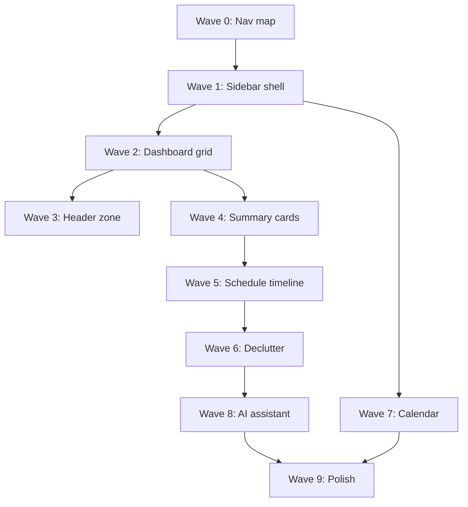

# Development Plan — Dashboard Layout Migration (Mockup → Production)

Branch: `feature/dashboard-layout-migration`

Status: Planned

Related plans:

- `docs/waves/wave-03-dashboard.md` — Today command center data wiring
- `docs/waves/wave-12-schedule.md` — Schedule feature foundation
- `docs/waves/wave-00-nav-rename.md` — Nav label conventions
- `docs/ui-style-guide.md` — Approved shell, cards, and interaction patterns
- `docs/planning-quality-rule.md` — Planning requirements (audit, TDD, integration tests)
- `docs/architecture-rules.md` — Feature ownership and data-access rules

---

## 1. Summary

Migrate Sheath Academy from the current **top-tab header + stacked dashboard widgets** layout to the **sidebar + focused Today view** shown in the dashboard mockup (May 2025 design review).

The mockup introduces:

- Left sidebar navigation with grouped feature links
- Personalized greeting header with Gregorian/Hijri date picker
- Three summary cards: Tasks Completed / In Progress / Overdue
- Full-day **Today's Schedule** timeline as the dashboard hero
- Right rail: Alerts + AI Personal Assistant (Beta)
- Slim top bar with Quick Add, Today's Plan, and notifications

This plan is **incremental and shippable in waves**. Each wave preserves existing routes and behavior until the new layout reaches parity. No wave requires a big-bang rewrite.

**Goals:**

1. Replace horizontal tab nav in `Header.tsx` with a persistent sidebar shell.
2. Reshape the dashboard into a schedule-first command center.
3. Reuse existing data paths (lessons, schedule, alerts, Hijri dates) before adding new APIs.
4. Defer net-new features (Messages, Finances, LLM assistant) to later waves with placeholders.

---

## 2. Planning Mode

Mode 4 — New Feature (layout shell + dashboard composition)

Reason: Cross-cutting layout change affecting all `(shell)` routes, new UI components, dashboard metric extensions, and broad e2e test updates. Not a tiny styling fix.

---

## 3. Current State Audit

### App shell

| Layer | Current behavior |
|--------|------------------|
| Shell | `features/layout/front/components/AppShell.tsx` — `Header` + `<main>` |
| Nav | Horizontal tabs in `features/layout/front/components/Header.tsx` (Today, Growth, Records, Plan, Resources, Lessons, Attendance, Quran, Settings, Admin, About) |
| Mobile | Hamburger dropdown replicates tab list |
| Hijri date | Shown in header via `formatHeaderDates` |
| Page width | `max-w-7xl mx-auto` on dashboard sections |

**Gap:** No sidebar. No personalized greeting. No date picker. No Quick Add / Today's Plan actions.

### Dashboard (`features/dashboard/front/pages/Dashboard.tsx`)

| Section | Component | Data source |
|---------|-----------|-------------|
| Setup strip | `NextSetupStrip` | Setup status API |
| Child filter | `ChildSelector` (sticky) | `DashboardProvider` context |
| Readiness bar | `TodayStatusSummary` | `DashboardMetrics` (attendance, quran, needsAttention, lessonsPlanned, portfolioItems) |
| Today state | `TodayState` | Metrics + selectedChildId |
| Alerts | `NeedsAttention` | `DashboardProvider.alerts` → alerts service |
| Do Today | `DoToday` → `TodayLessonCard` | Planner API |
| Subject activity | `SubjectActivity` | Weekly completed lessons |
| Now & Next | `ScheduleNowNextCard` | `buildDailySchedule()` client-side |
| School year | `SchoolYearProgressCard` | School year service |
| Quran streak | `QuranStreak` | Quran sessions |
| Islamic countdowns | `IslamicCalendarCard` | `getIslamicCalendarCountdowns()` |
| Weekly activity | `WeeklyActivity` | Weekly lessons + quran |
| Records proof | `RecordsProof` | Dashboard records |

**Gap vs mockup:** Widget-heavy layout; schedule is a small "Now & Next" card, not a full timeline. No Completed/In Progress/Overdue summary cards. Alerts are in the main column, not a right rail. No AI assistant.

### Schedule feature

| Layer | Location |
|--------|----------|
| Types | `features/schedule/types.ts` — `DaySchedule`, `ScheduleBlock` |
| Builder | `features/schedule/server/service.ts` — `buildDailySchedule()` |
| Day page | `app/(shell)/plan/schedule/page.tsx` → `SchedulePage.tsx` (block list, no status badges) |
| Dashboard card | `ScheduleNowNextCard.tsx` — current/next block by time |

**Gap:** No status badges (Completed / In Progress / Planned). No break/prayer blocks. Timeline UI exists in rudimentary form on `/plan/schedule`, not on dashboard.

### Lesson status model

`features/plan/types.ts`:

```ts
LessonTaskStatus = 'not_started' | 'completed' | 'skipped'
```

**Gap:** No stored `in_progress` status. Mockup "In Progress" must be **derived**: current schedule block by wall-clock time + `status !== 'completed'`.

### Overdue logic

Already exists in `features/alerts/server/service.ts` — filters pending lessons where `dueDate < today`.

### Dashboard metrics

`features/lib/types.ts` → `DashboardMetrics`:

```ts
attendanceReady, lessonsPlanned, needsAttention, quranLogged, portfolioItems
```

**Gap:** No `tasksCompleted`, `tasksInProgress`, or `tasksOverdue` counts for summary cards.

### Existing tests to update

| Test file | Risk |
|-----------|------|
| `e2e/portfolio.spec.ts` | References "third tab in dashboard navigation" |
| `e2e/cross-feature-linked-filtering.spec.ts` | Dashboard → feature navigation |
| `e2e/alerts-links.spec.ts` | Alert link targets from dashboard |
| `e2e/dashboard.spec.ts` | Islamic calendar cards on Today |
| `features/layout/__tests__/Header.test.tsx` | Header tab behavior |
| `features/dashboard/__tests__/integration/**` | Dashboard component layout |

---

## 4. Mockup → Route Map (Wave 0 decisions)

Lock before Wave 1 implementation:

| Mockup nav item | Target route / feature | Wave 1 action |
|-----------------|------------------------|---------------|
| Dashboard | `/` | Active |
| Calendar | None today | Placeholder → `/plan/schedule` until Wave 7 |
| Lesson Planner | `/plan` | Direct |
| Courses | `/lessons` | Direct (subjects via settings) |
| Attendance | `/attendance` | Direct |
| Grades & Progress | `/growth`, `/portfolio` | Single nav item; active when either path matches |
| Reports & Records | `/records` | Direct |
| People | `/settings` (children section) | Deep link with tab param |
| Resources | `/resources` | Direct |
| Messages | None | Disabled placeholder + badge stub |
| Finances | None | Disabled placeholder |
| Compliance | `/settings` (RecordsComplianceTab) | Deep link |

**Product decisions (Wave 0):**

1. **Greeting name** — session user first name vs selected child name ("Assalamu alaikum, Aisha"). Recommend: parent/guardian name from session; child context via `ChildSelector`.
2. **Child selector placement** — keep in dashboard header zone until People nav is mature.
3. **In Progress semantics** — derived from schedule + time, not a new DB status.
4. **Brand** — mockup shows "Sheath" + tagline "Faith. Learning. Purpose."; current app shows "Sheath Academy" + version. Decide in Wave 9 polish.

---

## 5. Migration Waves

### Wave 0 — Decisions & nav config (no UI)

**Deliverables:**

- `features/layout/lib/navConfig.ts` — nav items, hrefs, icons, placeholder flags, badge keys
- Written route map (section 4 above) signed off

**Exit criteria:** Nav config file exists; every item resolves to a route or explicit placeholder.

---

### Wave 1 — App shell: sidebar + slim top bar

**Goal:** Replace horizontal tab bar with left sidebar. Page content unchanged.

**Touch:**

- `features/layout/front/components/AppShell.tsx` — grid: `[sidebar | content column]`
- New: `features/layout/front/components/Sidebar.tsx`
- New: `features/layout/lib/navConfig.ts`
- Refactor: `features/layout/front/components/Header.tsx` — remove tab row; keep brand, auth, mobile trigger

**Layout:**

```
┌──────────┬─────────────────────────────────────┐
│ Sidebar  │ TopBar (brand/auth/bell)            │
│ 240px    ├─────────────────────────────────────┤
│          │ {children — unchanged pages}        │
└──────────┴─────────────────────────────────────┘
```

**Responsive:**

- Desktop (`md+`): persistent sidebar
- Mobile: sidebar → drawer (reuse hamburger pattern from current Header)

**UI style guide:**

- Reuse approved shell pattern (§9 in `docs/ui-style-guide.md`)
- Active nav item: forest-900 background (match current active tab styling)
- Icon-only sidebar collapse optional in Wave 9

**Tests:**

- Unit/integration: `Sidebar.test.tsx` — renders all nav items, active route highlight, placeholder disabled state
- Update: `features/layout/__tests__/Header.test.tsx`
- Update e2e: `e2e/portfolio.spec.ts`, any test referencing tab nav → sidebar links

**Exit criteria:** All existing routes reachable via sidebar; no page content regressions.

---

### Wave 2 — Dashboard page grid (structure only)

**Goal:** Reshape `Dashboard.tsx` into mockup 3-zone layout. Existing widgets remain reachable.

**Target layout:**

```
[Summary cards row — placeholder or existing TodayStatusSummary]
┌────────────────────────────┬──────────────────┐
│ Today's Schedule (2/3)     │ Alerts rail (1/3)│
│ (placeholder / link)       │ NeedsAttention   │
└────────────────────────────┴──────────────────┘
[Below fold: existing widgets — DoToday, WeeklyActivity, etc.]
```

**Touch:**

- `features/dashboard/front/pages/Dashboard.tsx` — new grid wrapper
- Move `NeedsAttention` into right column shell
- Placeholder center: link to `/plan/schedule` or embed `ScheduleNowNextCard` temporarily

**Tests:**

- Integration: dashboard renders 2-column grid on `lg+`
- Integration: NeedsAttention visible in right column
- Integration: existing widgets still render below fold

**Exit criteria:** Dashboard structure matches mockup grid; no data behavior changes.

---

### Wave 3 — Dashboard header zone

**Goal:** Greeting, date display, Quick Add / Today's Plan.

**New components** (`features/dashboard/front/components/` or `features/layout/front/components/`):

| Component | Behavior |
|-----------|----------|
| `DashboardGreeting` | "Assalamu alaikum, {name}" from session / household |
| `DashboardDateBar` | Gregorian + Hijri; Wave 3a: today only; Wave 5b: date navigation |
| `QuickAddMenu` | Dropdown → log Quran, mark attendance, add lesson (existing routes/modals) |
| `TodaysPlanLink` | Link to `/plan` or scroll to schedule section |

**Reuse:**

- `formatHeaderDates` from `features/layout/lib/formatHeaderDates`
- Session from `next-auth`; household from `useHousehold()`

**Touch:**

- Absorb or relocate sticky `ChildSelector` into header zone

**Tests:**

- Integration: greeting renders with session name; fallback when anonymous
- Integration: Hijri date visible
- Integration: Quick Add menu opens and links work

**Exit criteria:** Header zone matches mockup; child selector still functional.

---

### Wave 4 — Summary status cards

**Goal:** Replace `TodayStatusSummary` readiness % with three cards.

**Metrics (extend dashboard service):**

| Field | Derivation |
|-------|------------|
| `tasksCompleted` | Today's lessons where `status === 'completed'` |
| `tasksInProgress` | Current schedule block (by wall-clock) where `status !== 'completed'` — max 1 |
| `tasksOverdue` | Lessons where `dueDate < today && status !== 'completed'` (reuse alerts logic) |

**Approach:** Extend `DashboardMetrics` + dashboard summary API/service (preferred over client-only derivation for testability).

**Touch:**

- `features/lib/types.ts` or `features/dashboard/types.ts` — extend `DashboardMetrics`
- Dashboard server service / repository
- New: `TodayTaskSummaryCards.tsx`
- Deprecate: `TodayStatusSummary.tsx` (remove after parity)

**Tests:**

- Unit: metric computation with seed fixtures — 0 lessons, all completed, mixed overdue
- Integration: three cards render correct counts
- Integration: empty household → zero states with friendly copy

**Exit criteria:** Summary cards match mockup; readiness bar removed.

---

### Wave 5 — Today's Schedule timeline (hero)

**Goal:** Full-day vertical timeline as dashboard centerpiece.

**Reuse:**

- `buildDailySchedule()` — `features/schedule/server/service.ts`
- Block rendering from `SchedulePage.tsx`
- Current/next logic from `ScheduleNowNextCard.tsx`

**New:**

- `features/schedule/front/components/TodayScheduleTimeline.tsx`

**Wave 5a — Lesson blocks + status badges:**

| Badge | Rule |
|-------|------|
| Completed | `lesson.status === 'completed'` |
| In Progress | Block is current by time AND not completed |
| Planned | `not_started` and not current |

**Wave 5b — Non-lesson blocks (optional):**

- Extend schedule model with `blockType: 'lesson' | 'break' | 'prayer'`
- Or household schedule template in settings (Break, Lunch & Dhuhr)

**Wire:**

- Dashboard: `plannerApi.getLessons` → `buildDailySchedule` → `TodayScheduleTimeline`
- Remove `ScheduleNowNextCard` from dashboard once timeline highlights "now"
- Footer: "{n} of {m} items scheduled" + "View Day's Plan" link

**Tests:**

- Integration: timeline renders blocks with correct badges
- Integration: empty schedule → empty state
- Integration: current-time highlight (mock `Date` or inject `currentTime` prop)
- Update: `features/schedule/__tests__/integration/SchedulePage.test.tsx` patterns

**Exit criteria:** Timeline is dashboard hero; `/plan/schedule` remains full-page day view.

---

### Wave 6 — Right rail consolidation + dashboard declutter

**Goal:** Alerts panel matches mockup styling; relocate demoted widgets.

**Alerts rail:**

- Restyle `NeedsAttention` / `AlertItem` — compact color-coded list (severity → red/orange/blue/green)
- Keep existing alert links (preserve `e2e/alerts-links.spec.ts` behavior)

**Widget relocation:**

| Current widget | New home |
|----------------|----------|
| `WeeklyActivity` | `/growth` or collapsible "This week" section |
| `SubjectActivity` | `/growth` |
| `SchoolYearProgressCard` | `/records` |
| `QuranStreak` | `/quran` (optional summary chip in header) |
| `IslamicCalendarCard` | Calendar page or settings reminders |
| `RecordsProof` | `/records` |
| `DoToday` | Remove after timeline parity verified |
| `TodayState` | Remove or merge into summary cards |

**Tests:**

- Integration: dashboard shows only header + summary + timeline + alerts
- e2e: alert links still navigate correctly
- e2e: cross-feature linked filtering still works from new layout

**Exit criteria:** Dashboard matches mockup content set; demoted widgets accessible elsewhere.

---

### Wave 7 — Calendar page

**Goal:** Real destination for Calendar nav item.

**Options:**

- **Minimal (recommended first):** Week view reusing `WeekGrid` from `features/plan/front/components/WeekGrid.tsx`
- **Full (later):** Month grid + Hijri overlay + day drill-down

**Touch:**

- New route: `app/(shell)/calendar/page.tsx` (or extend `/plan`)
- Update `navConfig.ts` Calendar href

**Tests:**

- Integration: calendar page loads with week data
- e2e: sidebar Calendar link navigates correctly

**Exit criteria:** Calendar nav is functional; `/plan/schedule` remains day detail.

---

### Wave 8 — AI Personal Assistant (net-new)

**Goal:** Right-rail "Personal Assistant" panel below alerts.

**Phased:**

1. **8a — Rule-based insights (no LLM):** e.g. "Friday overloaded" from week grid hour counts
2. **8b — Action links:** "Reschedule 2 lessons" → `/plan` with query params
3. **8c — LLM layer (optional):** new `features/assistant/` feature, env-gated

**Do not block Waves 1–6.** Ship styled placeholder with one deterministic rule in 8a.

**Tests:**

- Unit: imbalance detection from fixture week data
- Integration: assistant panel renders insight when rule fires; hidden when balanced

**Exit criteria:** Assistant panel visible with at least one real rule-based suggestion.

---

### Wave 9 — Placeholder nav items + polish

**Goal:** Complete nav map; visual polish.

| Item | Minimum viable |
|------|----------------|
| Messages | Empty state page; notification badge stub |
| Finances | "Coming soon" page |
| Compliance | `/settings?tab=compliance` |
| People | Children management (settings tab) |
| Courses | Subjects/lessons landing |

**Polish:**

- Tagline "Faith. Learning. Purpose."
- Brand consistency ("Sheath" vs "Sheath Academy")
- Purple accent for AI panel
- Sidebar collapse on desktop (optional)

**Exit criteria:** All sidebar items resolve; no dead links.

---

## 6. Dependency Graph



Waves 3 and 4 can run **in parallel** after Wave 2. Wave 8 can slip post-launch.

---

## 7. Recommended First Sprint

**Waves 0 + 1 + 2** — lowest risk, highest visual impact:

1. Wave 0 — nav config + decisions (half day)
2. Wave 1 — sidebar shell
3. Wave 2 — dashboard grid + alerts right rail

Then Waves 4–5 for mockup content parity.

---

## 8. Integration Test Plan (per wave)

| Wave | Required tests |
|------|----------------|
| 0 | Nav config unit test — every item has href or `placeholder: true` |
| 1 | Sidebar: active state, mobile drawer, all routes reachable |
| 2 | Dashboard grid layout; NeedsAttention in right column |
| 3 | Greeting, Hijri date, Quick Add menu |
| 4 | Summary card counts — empty, completed, overdue |
| 5 | Timeline badges, current-time highlight, empty schedule |
| 6 | Alert links; demoted widgets on target pages |
| 7 | Calendar page loads |
| 8 | Rule-based assistant insight |
| 9 | All nav items resolve |

Follow `docs/testing-patterns.md` — mock at repository boundary for API tests; integration tests under `features/<feature>/__tests__/integration/`.

---

## 9. Data Flow Trace (dashboard hero path)

```
Dashboard.tsx
  → plannerApi.getLessons(weekStart, childIds)     [features/plan/front/services/api]
  → filter dueDate === today, sort by order
  → buildDailySchedule(lessons, settings)           [features/schedule/server/service]
  → TodayScheduleTimeline(schedule, currentTime)    [new component]
  → ScheduleBlock.lesson.status → badge
  → findCurrentBlock(blocks, currentTime) → In Progress badge

Dashboard summary cards:
  → GET /api/dashboard/summary (extended metrics)   [features/dashboard/api]
  → dashboard service → plan repository + alerts logic
  → TodayTaskSummaryCards(metrics)
```

**ID consistency:** `childId` on lessons = `StudentProfile.id`; `householdId` = `HouseholdProfile.id` (not `Workspace.id`). Confirm in seed fixtures before Wave 4.

---

## 10. Defer List (avoid scope creep)

- **Messages / Finances** — no backend; placeholders until Wave 9
- **Break/prayer schedule blocks** — Wave 5b optional; not required for MVP timeline
- **Historical date picker** — today-only in Wave 3; date navigation in Wave 5b or 7
- **LLM assistant** — Wave 8c optional; rule-based first
- **Removing multi-child filtering** — keep `ChildSelector` through Wave 6

---

## 11. Pre-implementation Checklist (every wave)

Per `docs/planning-quality-rule.md` and `CLAUDE.md`:

1. Sync with master — `git fetch origin && git merge origin/master`
2. Read actual type files before editing (`LessonTask`, `DashboardMetrics`, `DaySchedule`, `Alert`)
3. Trace data path — use existing services, do not reach into stores from UI
4. Verify route wiring — new pages registered under `app/(shell)/`
5. Write failing integration test first (TDD)
6. `npm run build` and `npm test` pass before merge

---

## 12. Acceptance Criteria (full migration)

- [ ] Sidebar nav replaces horizontal tabs on all `(shell)` pages
- [ ] Dashboard shows greeting, date bar, three summary cards, timeline, alerts rail
- [ ] Schedule timeline reflects real lesson data with correct status badges
- [ ] Alerts link to correct feature pages (e2e green)
- [ ] Demoted widgets accessible from their new homes
- [ ] Calendar nav has a functional page
- [ ] AI assistant shows at least one rule-based insight
- [ ] All sidebar items resolve (route or placeholder)
- [ ] Mobile layout usable (drawer nav, stacked dashboard columns)
- [ ] No regressions in cross-feature linked filtering e2e suite
